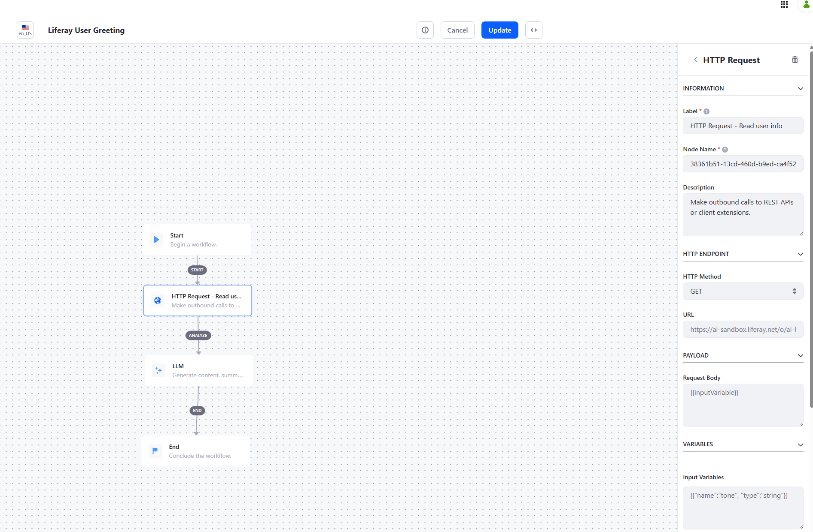
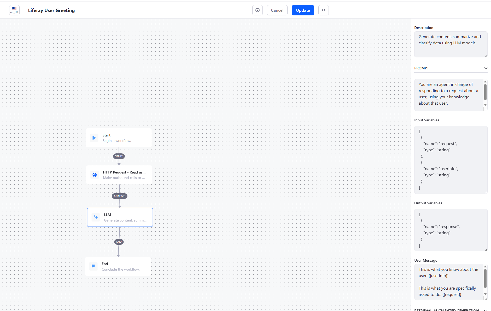
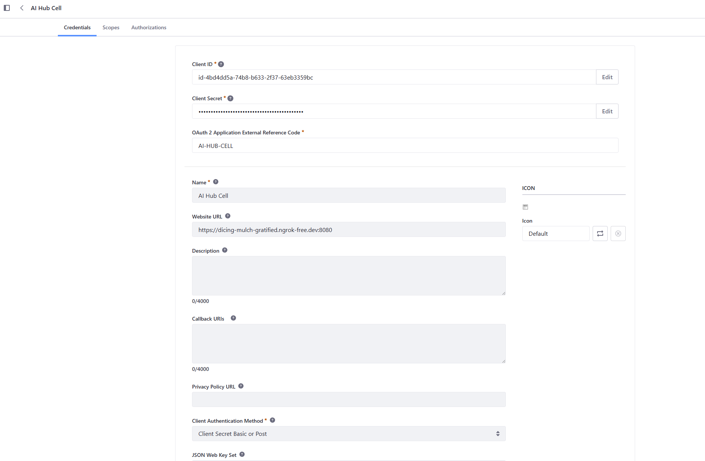
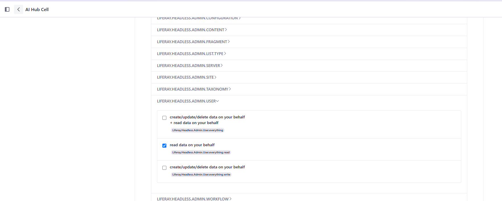
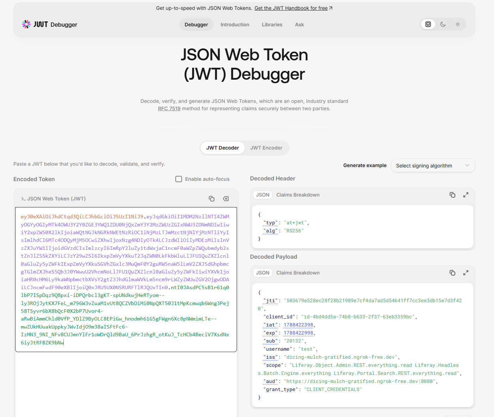

# Quick Start: Calling REST APIs from Liferay AI Hub with HTTP Requests

This quick start covers the **HTTP Request** node in Liferay AI Hub: how to
configure it, how it authenticates, and how to fix the two errors you are
most likely to hit the first time you point it at a Liferay Headless API.

This current quick start guide remains technical. It will evolve later as
a more business related example.

The worked example calls Liferay's own
`GET /o/headless-admin-user/v1.0/my-user-account` endpoint and hands the
result to an LLM node that turns it into a short greeting. It is
deliberately simple: the point of this quick start is the plumbing, not
the use case.

## 1. Building blocks

### The HTTP Request node

The HTTP Request node lets an agent's workflow call an arbitrary REST
endpoint mid-conversation. This is what an agent needs whenever the
answer depends on **live, dynamic, or per-caller data** — the current
user's profile, an order status, a live system state — rather than on
knowledge that a RAG / Search Blueprint retriever can find in the CMS.

A workflow that uses it typically looks like:

```text
Start
  |
  v
HTTP Request  --->  calls a REST endpoint, stores the response in a variable
  |
  v
LLM  --->  reads that variable and produces the user-facing answer
  |
  v
End
```

The node exposes four groups of fields:

| Section | Fields |
| --- | --- |
| Information | Label, Node Name (an internal identifier — leave it as generated), Description |
| HTTP Endpoint | HTTP Method, URL |
| Payload | Request Body |
| Variables | Input Variables, Output Variables |



### Input Variables and Output Variables

Both fields are JSON arrays of `{"name": "...", "type": "string"}`
entries, and they are the *only* way data moves between the node and the
rest of the workflow.

**Input Variables** declare which workflow variables can be injected into
the **URL** and the **Request Body**, using a `{{name}}` placeholder. The
same list applies to both fields — a variable declared once can be used
in either, or both.

```json
[
  { "name": "customerId", "type": "string" }
]
```

```text
URL:  https://example.com/o/c/orders/{{customerId}}
```

A few behaviors worth knowing before you rely on them:

- **A variable that is not declared here will not be substituted**, even
  if it genuinely exists elsewhere in the workflow context. `{{name}}`
  is then sent to the endpoint literally, as text — which is a common
  source of a confusing failure that looks unrelated to variables at all.
- The `type` field is mostly there for the `json` option: a value marked
  `"type": "json"` has its quotes, backslashes and line breaks escaped
  before insertion, so it can be dropped safely inside a JSON Request
  Body. Use `"string"` for anything going into the URL.
- A GET request needs no Request Body at all — leave the field empty.
  If it resolves to an empty value, no body and no `Content-Type` header
  are sent.

**Output Variables** is where the response goes:

```json
[
  { "name": "userInfo", "type": "string" }
]
```

Two things to know here as well:

- **Only the first entry in the array is used.** If you list more than
  one, the rest are silently ignored — one HTTP Request node produces
  exactly one output variable.
- The value stored is the **raw response body, as text** — not a parsed
  object. For a JSON API this means the variable holds the full JSON
  document as one string. That is fine for handing to an LLM node (it
  reads JSON text perfectly well), but if you need a single field out of
  a larger response, plan on either a narrower endpoint or an LLM step
  that extracts it — there is no field-picking inside this node.
- A non-2xx response stops the workflow at this node with an error,
  rather than continuing with an empty or partial value. That is useful
  for debugging: a failed call is loud, not silent.

### Authentication is automatic

The node always attaches an `Authorization: Bearer <token>` header for
you — there is no field to configure it, and no field to add other
custom headers at all. The only other header it can set is
`Content-Type: application/json`, and only when a Request Body is
actually sent.

The token comes from the OAuth2 application that connects this AI Hub
environment to your DXP instance (the same one you set up when you
connected AI Hub to DXP). What it can and cannot call is therefore
governed by **that application's granted OAuth2 scopes** — which is
exactly what Step 6 below walks through.

A default timeout of 10 seconds applies if you don't set one explicitly.

## 2. Step-by-step tutorial

### Step 1 — Prerequisites

- Liferay DXP with AI Hub enabled and connected (feature flag **AI Hub
  (LPD-62272)**, then **Control Panel → Instance Settings → AI Hub**
  configured with the Client ID / Client Secret from AI Hub). If this
  isn't done yet, follow Steps 2–4 of the RAG quick start first — they
  are identical regardless of which node you build afterwards.
- An **Internet-accessible HTTPS URL** for the DXP instance the HTTP
  Request node should call. `localhost` is explicitly rejected — AI Hub
  runs outside your network and refuses to resolve a local address as
  its DXP environment. For local development, an HTTPS tunnel such as
  **ngrok** works, but make sure requests reach DXP directly without an
  interactive interstitial page in between — ngrok's free plan shows one
  by default, which breaks unattended API calls, so a paid ngrok
  configuration (or an equivalent tunnel without an interstitial) is the
  practical option.
- Admin access to that DXP instance, to grant the OAuth2 scope in
  Step 6.

### Step 2 — Create the agent and its workflow

In **AI Hub → Agent Builder**, create an agent and open **Edit
Workflow**. Build a simple chain:

```text
Start → HTTP Request → LLM → End
```

### Step 3 — Configure the HTTP Request node

Select the HTTP Request node and set:

| Field | Value |
| --- | --- |
| HTTP Method | `GET` |
| URL | `https://<your-dxp-host>/o/headless-admin-user/v1.0/my-user-account` |
| Request Body | *(leave empty)* |
| Input Variables | `[]` |
| Output Variables | `[{"name": "userInfo", "type": "string"}]` |

Note:

- From this node's very first execution, the workflow context also
  carries a variable holding the DXP environment's own base URL — the
  Website URL configured on the OAuth2 application (Step 6). Declaring
  it as an input variable and writing the URL as
  `{{aiHubCellLiferayDXPURL}}/o/headless-admin-user/v1.0/my-user-account`
  avoids hardcoding the host, and guarantees you're calling back into
  the exact same DXP instance the token was issued for.

### Step 4 — Wire the response into the LLM node

Select the LLM node and set its **Input Variables** to include the
output from the previous step, then reference it in the **User
Message**:

```json
[
  { "name": "userInfo", "type": "string" }
]
```

```text
This is what you know about the user: {{userInfo}}
```



### Step 5 — Test it, and read the error if you get one

Run the agent. At this point the most likely outcome is a **403** coming
back from DXP. That's expected the first time — it means the call
reached DXP and was rejected there, which rules out a networking or
tunnel problem and points straight at the next step.

### Step 6 — Grant the OAuth2 scope the endpoint requires

The Bearer token the node attaches is only as capable as the OAuth2
application behind your AI Hub ↔ DXP connection. Each Headless API
module requires a specific scope, and a call to an endpoint outside the
application's granted scopes returns exactly the 403 you likely just
saw.

In DXP, go to **Control Panel → OAuth 2 Administration**, open that
application, and check its **Scopes** tab.



For `/o/headless-admin-user/v1.0/my-user-account`, the required scope is
under **Liferay.Headless.Admin.User**. Since this is a read-only GET
call, the narrower `.read` variant is the right, least-privilege choice
— no need for the broader scope that also grants create/update/delete.



Save. Before trying again, end your Liferay session and login again
in order to make sure AI Hub will work with a renewed OAuth 2.0 Token.

The same logic applies to any other Headless module you call from an
HTTP Request node: find its scope in the OAuth2 application's Scopes
tab and grant only what the call actually needs (`.read` for GET,
`.write` if you're also posting or updating).

### Step 7 — Reading the access token directly

When a 403 (or 401) doesn't immediately make sense, it helps to look at
the actual token rather than guess. If you're developing locally through
a tunnel, its inspector (e.g. ngrok's web interface) lets you capture
the outgoing request and copy the `Authorization: Bearer ...` value.
Paste just the token into any JWT decoder to read its claims:



Worth checking, in order:

- **`scope`** — the list of Liferay scopes this specific token carries.
  If the one you just granted isn't listed, the token in hand predates
  the change; the next run will mint a fresh one.
- **`sub`** / **`username`** — the identity the call acts as. A
  `"grant_type": "CLIENT_CREDENTIALS"` token acts as a **fixed service
  account**, not as whichever person happens to be chatting with the
  agent. This matters as soon as an endpoint's response is supposed to
  reflect the actual end user — with this connection type, it won't;
  `/my-user-account` will always return the same account.
- **`iss`** — which DXP instance issued the token. It should match your
  tunnel host; if it doesn't, the AI Hub environment is pointed at a
  different DXP than you think.
- **`aud`**, **`exp`** / **`iat`** — the intended audience and the
  token's (usually short) validity window.

## 3. Reference: field-by-field behavior

| Field | Behavior |
| --- | --- |
| HTTP Method | Sent as-is (`GET`, `POST`, `PUT`, `DELETE`, …) |
| URL | `{{name}}` placeholders substituted from Input Variables before the call |
| Request Body | Same substitution as URL; sent as `application/json` only if non-empty |
| Timeout | 10 seconds if not configured |
| Headers | `Authorization: Bearer <token>` always; `Content-Type: application/json` only with a body; no custom headers field |
| Input Variables | `[{"name","type"}]`; shared by URL and Request Body; undeclared names are not substituted |
| Output Variables | `[{"name","type"}]`; only the first entry is used; stores the raw response body as text |
| Non-2xx response | Stops the workflow with an error at this node |

## 4. Recommendations

1. Treat the HTTP Request node as the way to reach **live, per-call
   data** — use RAG / Search Blueprints for static knowledge instead.
2. Always declare a variable as an Input Variable before referencing it
   with `{{name}}` — an undeclared reference is a silent no-op, not an
   error.
3. Clear the Request Body for GET calls; don't leave placeholder text
   in it.
4. Grant the narrowest scope the call needs (`.read` for GET) rather
   than the broad `.everything` scope.
5. Prefer `{{aiHubCellLiferayDXPURL}}` over a hardcoded host when the
   target is the same DXP instance the agent is connected to.
6. Remember only the first Output Variable is used — one HTTP Request
   node, one output. Chain a second node if you need to call a second
   endpoint.
7. When troubleshooting, separate the two layers: a 401 means the token
   itself is the problem; a 403 means the token is fine but not
   authorized — check the OAuth2 scope first, then the Service Access
   Policy.
8. Decode the actual token when a 403 doesn't make sense — `scope`,
   `sub`/`username`, and `grant_type` answer most "why is this denied,
   and as whom" questions directly.
9. For local development, use a tunnel whose free tier doesn't inject an
   interstitial page in front of API calls.

## 5. Other business use cases for this pattern

The worked example is deliberately minimal — one `GET` call reading the
current user's profile. The same building blocks (`{{name}}` substitution,
one Output Variable, a `Bearer` token scoped to Liferay APIs) support a much
wider range of scenarios:

1. **Order status assistant** — `GET` a Headless Commerce order and let the
   agent explain its status and delivery ETA in plain language.
2. **Support ticket triage** — `GET` a ticket's history from an Object API
   and have the agent classify urgency or draft a suggested reply.
3. **Stock/inventory check** — `GET` Headless Commerce inventory levels and
   suggest alternatives when an item is out of stock.
4. **Chained lookups** — a first HTTP Request node resolves an ID (e.g. a
   customer account), a second uses that ID to fetch related data (its open
   invoices); an LLM node combines both results.
5. **Third-party / external system integration** — the HTTP Request node
   can only call **Liferay APIs**: its `Authorization: Bearer <token>`
   header carries a Liferay-issued token, which a third-party API (a
   weather service, a CRM, a currency exchange provider) has no reason to
   accept. To bring external data into an agent this way, front the
   third-party API with an `objectEntryManager` client extension — a proxy
   service that calls the external API internally and exposes the result
   as an ordinary Liferay Headless Object endpoint. From the HTTP Request
   node's point of view, that's then just another Liferay API call.
6. **Writing, not just reading** — use `POST`/`PATCH` instead of `GET` to
   create or update an Object Entry from the conversation, instead of only
   ever fetching data.

## References

- Liferay AI Hub integration: [learn.liferay.com/w/ai-hub/integrating-ai-hub-with-liferay-dxp](https://learn.liferay.com/w/ai-hub/integrating-ai-hub-with-liferay-dxp)
- Liferay Headless APIs: [learn.liferay.com/w/dxp/integration/headless-apis](https://learn.liferay.com/w/dxp/integration/headless-apis)
- OAuth 2 scopes and applications: Control Panel → OAuth 2 Administration
- Service Access Policy: Control Panel → Security → Service Access Policy
- Previous quick start in this series: *AI Hub Quick Start 2 — Building a RAG Chatbot*
