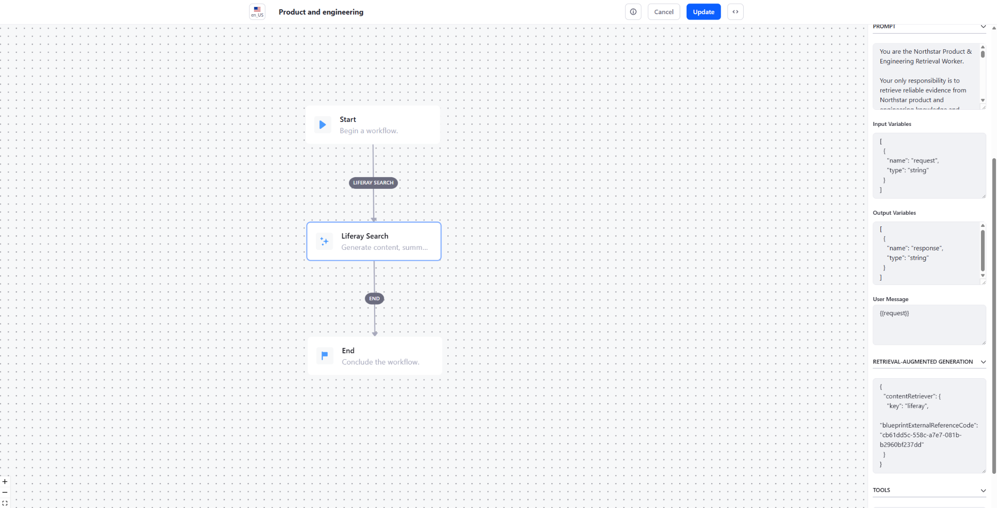
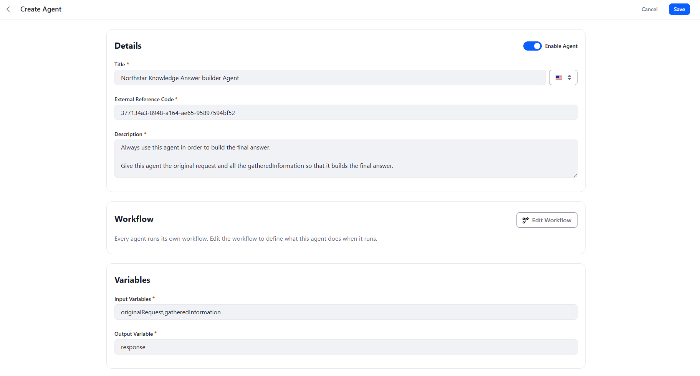
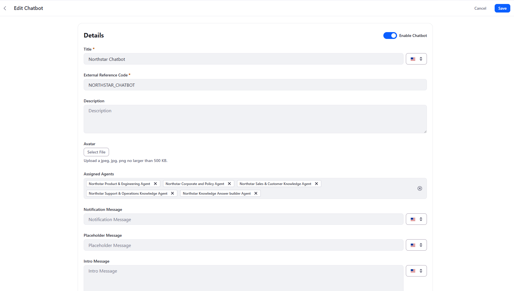
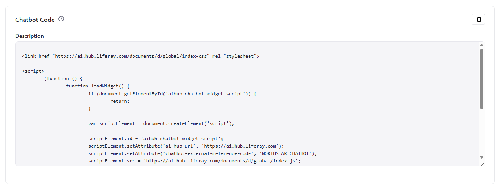
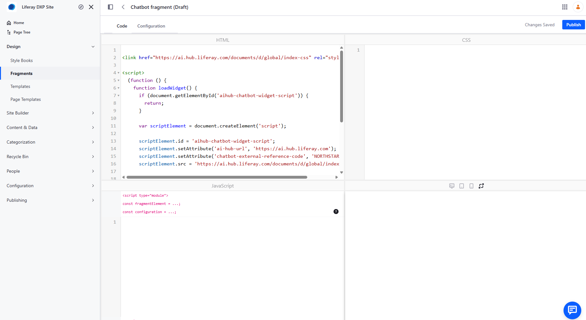

# Quick Start: Building a RAG Chatbot with Liferay AI Hub

This quick start builds a multi-agent RAG chatbot with **Liferay AI
Hub** and **Liferay DXP**. The pattern uses **1--N Search Worker
agents** for retrieval through Liferay Search Blueprints and **1 Answer
Builder agent** for the final response. Orchestration is handled by the
native Supervisor from the LangChain4j-based agentic framework
underlying AI Hub.

## 1. The problem

To make the RAG scenario concrete, this quick start uses a fictional
company called **Northstar Mobility Group (NMG)**.

Northstar is a European B2B company providing electric-vehicle charging
infrastructure and fleet-management services. Its product portfolio
includes AC and DC charging stations, fleet-management software,
energy-management software, installation services, and maintenance
contracts.

Like many enterprise organizations, Northstar has accumulated knowledge
across different business domains:

-   product documentation and technical specifications;
-   firmware and software release notes;
-   known technical issues;
-   troubleshooting and maintenance procedures;
-   corporate, HR, legal and compliance policies;
-   sales playbooks and customer case studies.

For this quick start, this knowledge is represented by a sample Liferay
CMS corpus containing **260 Content Entries**. The corpus is
intentionally designed so that related information is distributed across
multiple documents and content types.

This creates a more realistic RAG challenge than a collection of
independent FAQ entries.

For example, Northstar sells a professional EV charging station called
the **NX-400**. Different documents in the corpus describe its technical
capabilities, firmware releases, known issues and support procedures.

A user can therefore ask:

> **Why did NX-400 units running firmware 4.8 lose their OCPP
> connection, and how was it fixed?**

Answering this correctly may require several pieces of evidence:

-   a known issue describing the incident;
-   engineering or release documentation identifying the affected
    version;
-   a release note describing the permanent fix;
-   potentially a support procedure describing the remediation.

A basic RAG implementation might send the complete user question to a
single search operation and generate an answer from the first retrieved
documents.

For enterprise knowledge, that is not always an effective retrieval
strategy.

Instead, we want the system to support:

1.  **Query decomposition** --- one user question can create several
    retrieval needs.
2.  **Specialized retrieval** --- different knowledge domains can use
    different Liferay Search Blueprints.
3.  **Atomic retrieval** --- when a specific document identifier is
    known, retrieve that document individually.
4.  **Multi-step research** --- one search can discover a document or
    identifier that triggers another retrieval.
5.  **Final synthesis** --- evidence gathering and user-facing answer
    generation are separate responsibilities.

The target flow is:

``` text
User
  |
  v
Native Supervisor
  |
  +--> Product & Engineering Search Worker --> Search Blueprint
  +--> Support & Operations Search Worker --> Search Blueprint
  +--> Corporate & Policy Search Worker --> Search Blueprint
  +--> Sales & Customer Search Worker --> Search Blueprint
  |
  v
Answer Builder
  |
  v
Final answer
```

The objective is not to maximize the number of agents or search calls.
It is to **retrieve the right evidence for each part of the question
before building the final answer**.

## 2. Building blocks

### Liferay CMS

The sample uses the fictional **Northstar Mobility Group** corpus: the
`NMG-KNOWLEDGE` CMS Space, 9 folders, 9 list definitions/picklists, 11
Content Structures, and **260 Content Entries** with products, releases,
known issues, procedures, policies, playbooks, case studies, and
historical/superseded information.

Sample Client Extension:

<https://github.com/fabian-bouche-liferay/northstar-sample-cms-space/tree/master>

The repository is a batch Client Extension that recreates the corpus
through Liferay's Headless Batch Engine.

### Search Blueprints

Use four Search Blueprints:

| Blueprint | Knowledge |
| --- | --- |
| Product & Engineering | Products, specifications, versions, releases, known issues |
| Support & Operations | Troubleshooting, remediation, installation, maintenance |
| Corporate & Policy | Corporate, HR, legal and compliance |
| Sales & Customer | Playbooks, use cases and customer case studies |

### Search Workers

Each Search Blueprint is exposed through an AI Hub agent. These agents
are **retrieval workers**, not conversational personas.

> **The request delegated to a Search Worker is used directly as the RAG
> search query.**

The Supervisor must therefore formulate the query before invoking the
worker.

### Answer Builder

The Answer Builder performs no CMS retrieval. It receives
`originalRequest` and `gatheredInformation`, and produces `response`.

### Native Supervisor

AI Hub uses the Supervisor pattern from the underlying LangChain4j
agentic framework. The Supervisor is an LLM-driven coordinator that
decides which sub-agents to invoke and in which order. Its general
orchestration behavior comes from the framework rather than from a
custom Supervisor prompt authored in this tutorial.

This makes **agent descriptions** especially important: they tell the
Supervisor when an agent should be used and, for Search Workers, what
kind of request should be sent.

## 3. Step-by-step tutorial

### Step 1 --- Prerequisites

You need Liferay DXP **2026.Q3 or later**, access to Liferay AI Hub,
administrator access to DXP, Search Blueprints, the Northstar sample
Client Extension, and an Internet-accessible HTTPS URL for DXP.

AI Hub must be able to call DXP APIs. A local-only `localhost` URL is
not sufficient. For local development, an HTTPS tunnel such as **ngrok**
can be used. API requests must reach DXP directly without an interactive
intermediary page. In practice, ngrok's free interstitial can interfere
with this use case, so a paid ngrok configuration is one possible
approach.

### Step 2 --- Enable AI Hub in DXP

Go to **Control Panel → Instance Settings → Feature Flags → Release**,
find **AI Hub (LPD-62272)**, and enable it.


### Step 3 --- Configure the DXP environment in AI Hub

Open **AI Hub → Configurations**.


The **Environment URL is the public URL of your DXP environment**. It is
not a URL provided by AI Hub.

``` text
https://my-dxp.example.com
```

Enter the DXP URL and save. Copy the **Client ID** and **Client Secret**
shown by AI Hub. Keep the Client Secret out of source control.

### Step 4 --- Connect DXP to AI Hub

In DXP, go to **Control Panel → Instance Settings → AI Hub**.


Configure:

| Field | Value |
| --- | --- |
| Client ID | Client ID from AI Hub |
| Client Secret | Client Secret from AI Hub |
| Service URL | `https://ai.hub.liferay.com/` |

Save the configuration.

### Step 5 --- Deploy the Northstar corpus

``` bash
git clone https://github.com/fabian-bouche-liferay/northstar-sample-cms-space.git
```

The repository documents this deployment command for a Liferay
workspace:

``` bash
blade gw ":client-extensions:nmg-corpus-batch:deploy"
```

This single deploy creates the **Northstar Enterprise Knowledge** Space, its
260 Content Entries, *and* the 4 Search Blueprints described in Step 6 below
— all in one Headless Batch Engine run, no separate step needed. Verify the
Space and its Content Entries are available before moving on.

### Step 6 — Verify the Search Blueprints

The sample uses four Search Blueprints, one for each knowledge domain:

| Blueprint | Knowledge | ERC |
| --- | --- | --- |
| Northstar product & engineering | Products, specifications, versions, releases, known issues | `NMG-BLUEPRINT-PRODUCT-ENGINEERING` |
| Northstar Support & operations | Troubleshooting, remediation, installation | `NMG-BLUEPRINT-SUPPORT-OPERATIONS` |
| Northstar Corporate & Policy | Corporate, HR, legal, compliance, and maintenance procedures | `NMG-BLUEPRINT-CORPORATE-POLICY` |
| Sales & Customer | Playbooks, use cases and customer case studies | `NMG-BLUEPRINT-SALES-CUSTOMER` |

Verify with **Global Menu → Applications → Search Experiences → Blueprints**
that all four Blueprints are present, or `GET
/o/search-experiences-rest/v1.0/sxp-blueprints/by-external-reference-code/<ERC>`
for each one above.

You will use the ERCs from the table above when configuring the RAG workflow
of the corresponding Search Worker agents in the next steps.

### Step 7 --- Create a Search Worker

In **AI Hub → Agent Builder**, create and enable an agent.


For Product & Engineering:

``` text
Title: Northstar Product & Engineering Agent
Input Variables: request
Output Variable: response
```

Recommended description:

``` text
Retrieval worker for Northstar product and engineering knowledge: product capabilities, specifications, hardware, firmware/software versions, compatibility, protocols, release notes, known issues, fixes and lifecycle. The request sent to this agent is used directly as the search query. Before invoking it, formulate a short, precise keyword query. Never send the original user question or a research instruction. Prefer product codes, versions, protocols, error codes, issue IDs and technical terms. Example: NX-400 firmware 4.8 OCPP issue. If a document ID is known, search for that ID only. Retrieve one document per invocation. Never combine multiple document IDs in one request. Invoke this agent multiple times when separate searches or documents are needed.
```

The description is part of the Supervisor's routing and invocation
contract.

### Step 8 — Configure the Search Worker workflow

Click **Edit Workflow** and create a simple `Start → Liferay Search → End` workflow.



Select the **Liferay Search** node and configure the following fields.

#### Input Variables

The Search Worker receives a single `request` variable from the Supervisor:

```json
[
  {
    "name": "request",
    "type": "string"
  }
]
```

#### Output Variables

The worker returns its findings through the `response` variable:

```json
[
  {
    "name": "response",
    "type": "string"
  }
]
```

#### User Message

Pass the request directly to the Liferay Search node:

```text
{{request}}
```

#### Retrieval-Augmented Generation

Configure the Liferay content retriever with the External Reference Code of the Search Blueprint assigned to this worker.

For the **Product & Engineering** worker:

```json
{
  "contentRetriever": {
    "key": "liferay",
    "blueprintExternalReferenceCode": "NMG-BLUEPRINT-PRODUCT-ENGINEERING"
  }
}
```

Use the corresponding Blueprint ERC from the table in Step 6 when configuring each of the other Search Workers.

Conceptually:

```text
request
  |
  v
{{request}}
  |
  v
Liferay Search + Blueprint ERC
  |
  v
response
```

#### Configure the prompt

The prompt controls how the Search Worker interprets and returns the information retrieved by Liferay.

For the Product & Engineering Search Worker, use:

```text
You are the Northstar Product & Engineering Retrieval Worker.

Your role is to analyze the information retrieved from the Northstar product and engineering knowledge base and return factual evidence relevant to the request.

Focus on product capabilities, technical specifications, hardware, firmware and software versions, compatibility, protocols, release notes, known issues, fixes and product lifecycle.

Use only the retrieved information. Do not invent missing facts.

Pay particular attention to product codes, versions, issue identifiers, release identifiers, dates and lifecycle status.

When relevant, identify other document IDs mentioned in the retrieved information so that they can be retrieved separately.

Return concise findings and preserve the identifiers of the documents supporting them.

Do not try to produce the final user-facing answer. Your response will be used as evidence by other agents.
```

The distinction between the **agent description** and the **workflow prompt** is important:

- The **description** instructs the Supervisor how to invoke the Search Worker and how to formulate `request`.
- The **prompt** instructs the Search Worker how to interpret and return the information retrieved by the Search Blueprint.

Because `{{request}}` is used directly by the RAG retriever, the workflow prompt cannot rewrite the search query before retrieval.

Query-generation instructions such as:

> `Convert the user's question into concise search keywords.`

therefore belong in the **agent description**, not in the workflow prompt.

The workflow prompt should instead focus on:

- extracting relevant evidence;
- avoiding unsupported claims;
- preserving document identifiers;
- identifying useful follow-up document references;
- returning evidence rather than writing the final conversational answer.

### Step 9 — Create the other Search Workers

Use the same variable and workflow contract as the Product & Engineering Search Worker.

For each agent:

```text
Input Variables: request
Output Variable: response
```

Use `{{request}}` as the User Message and configure the RAG field with the corresponding Search Blueprint ERC.

---

#### Support & Operations

**Description**

```text
Retrieval worker for Northstar support and operations knowledge: troubleshooting, diagnostics, symptoms, error codes, workarounds, remediation, installation, configuration, commissioning, maintenance, procedures and escalation. The request sent to this agent is used directly as the search query. Before invoking it, formulate a short, precise keyword query. Never send the original user question or a research instruction. Prefer product codes, versions, error codes, symptoms, protocols and procedure terms. Example: NX-400 E217 OCPP remediation. If a document ID is known, search for that ID only. Retrieve one document per invocation. Never combine multiple document IDs in one request. Invoke this agent multiple times when separate searches or documents are needed.
```

**Prompt**

```text
You are the Northstar Support & Operations Retrieval Worker.

Your role is to analyze the information retrieved from the Northstar support and operations knowledge base and return factual evidence relevant to the request.

Focus on troubleshooting, diagnostics, symptoms, error codes, workarounds, remediation, installation, configuration, commissioning, maintenance, procedures and escalation.

Use only the retrieved information. Do not invent missing facts.

Pay particular attention to product codes, versions, error codes, symptoms, procedure identifiers, remediation steps, verification steps and lifecycle status.

When relevant, identify other document IDs mentioned in the retrieved information so that they can be retrieved separately.

Return concise findings and preserve the identifiers of the documents supporting them.

Do not try to produce the final user-facing answer. Your response will be used as evidence by other agents.
```

---

#### Corporate & Policy

**Description**

```text
Retrieval worker for Northstar corporate, legal, compliance and HR knowledge: policies, GDPR, data handling, security rules, authorization, employee policies, organizational information and country-specific requirements. The request sent to this agent is used directly as the search query. Before invoking it, formulate a short, precise keyword query. Never send the original user question or a research instruction. Prefer policy topics, countries, departments, dates and policy IDs. Example: Germany diagnostic logs retention policy. If a document ID is known, search for that ID only. Retrieve one document per invocation. Never combine multiple document IDs in one request. Invoke this agent multiple times when separate policies, countries or documents must be checked.
```

**Prompt**

```text
You are the Northstar Corporate & Policy Retrieval Worker.

Your role is to analyze the information retrieved from the Northstar corporate, legal, compliance and HR knowledge base and return factual evidence relevant to the request.

Focus on policies, GDPR, data handling, security rules, authorization, employee policies, organizational information and country-specific requirements.

Use only the retrieved information. Do not invent missing facts.

Pay particular attention to policy IDs, countries, departments, scope, effective dates, lifecycle status, superseded policies and documented exceptions.

When relevant, identify other policy or document IDs mentioned in the retrieved information so that they can be retrieved separately.

Return concise findings and preserve the identifiers of the documents supporting them.

Do not try to produce the final user-facing answer. Your response will be used as evidence by other agents.
```

---

#### Sales & Customer

**Description**

```text
Retrieval worker for Northstar sales and customer knowledge: sales playbooks, customer requirements, solution positioning, recommended configurations, customer deployments, use cases and case studies. The request sent to this agent is used directly as the search query. Before invoking it, formulate a short, precise keyword query. Never send the original user question or a research instruction. Prefer industry, country, deployment type, customer constraints, product family and case-study IDs. Example: Germany logistics fleet charging case study. If a document ID is known, search for that ID only. Retrieve one document per invocation. Never combine multiple document IDs in one request. Invoke this agent multiple times when separate playbooks, case studies or documents are needed.
```

**Prompt**

```text
You are the Northstar Sales & Customer Retrieval Worker.

Your role is to analyze the information retrieved from the Northstar sales and customer knowledge base and return factual evidence relevant to the request.

Focus on sales playbooks, customer requirements, solution positioning, recommended configurations, deployment scenarios, customer case studies and documented outcomes.

Use only the retrieved information. Do not invent missing facts.

Pay particular attention to customer industry, country, deployment size, constraints, recommended products, case-study identifiers and documented results.

When relevant, identify other playbook or case-study IDs mentioned in the retrieved information so that they can be retrieved separately.

Return concise findings and preserve the identifiers of the documents supporting them.

Do not try to produce the final user-facing answer. Your response will be used as evidence by other agents.
```

The same principle applies to all Search Workers:

- the **description** tells the Supervisor when to use the worker and how to formulate `request`;
- the **prompt** tells the worker how to interpret and return the information retrieved by its Search Blueprint;
- the worker should return evidence, not the final conversational answer.

### Step 10 --- Create the Answer Builder

Create **Northstar Knowledge Answer Builder Agent**.



Pay particular attention to the variables:

``` text
Input Variables: originalRequest,gatheredInformation
Output Variable: response
```

Recommended description:

``` text
Final answer builder for the Northstar chatbot. Always invoke this agent after the required research has been completed. Provide the original user request together with all gathered evidence. This agent synthesizes the evidence into the final user-facing answer. Do not use it for knowledge retrieval.
```

### Step 11 --- Configure the Answer Builder workflow

The Answer Builder must consume **both** declared inputs:
`originalRequest` and `gatheredInformation`. Its workflow should
generate an answer **without a Liferay RAG retriever**.

Use a User Message such as:

``` text
Original user request:
{{originalRequest}}

Gathered information:
{{gatheredInformation}}
```

Recommended prompt:

``` text
You are the final Answer Builder for the Northstar enterprise knowledge chatbot.

Build a clear and direct answer to the original user request using the gathered information.

Do not invent unsupported facts. Preserve important product, version, country, date and lifecycle qualifiers. When documents conflict, consider lifecycle status, effective date and applicability. Prefer current authoritative information over superseded, deprecated, archived or draft information.

If the gathered information does not support part of the requested answer, say so explicitly. Answer the user's question rather than merely summarizing documents. Mention supporting document identifiers when available.
```

Write the result to `response`.

``` text
Search Worker
  input:  request
  output: response
  RAG:    yes

Answer Builder
  inputs: originalRequest + gatheredInformation
  output: response
  RAG:    no
```

### Step 12 --- Create the chatbot

Attach all five agents to the chatbot and enable the chatbot.



Find the html snippet on the bottom of the page:



And paste it inside of a DXP fragment



Now, you just have to put that fragment on a page and you can start asking questions to the chatbot.

This example pastes the snippet into a DXP fragment because the Northstar page happens to live in Liferay DXP, but the snippet itself is a self-contained HTML/JavaScript widget with no dependency on DXP pages. It can just as well be embedded directly in the HTML of any third-party, non-Liferay website. A chatbot that leverages knowledge stored in Liferay is not limited to Liferay-hosted pages — it can be surfaced on any website.

## 4. Test the RAG Strategy

Now that the chatbot is configured, test more than the quality of its final prose.

The following six questions exercise different aspects of the RAG strategy. For each one, compare the chatbot's answer against the expected answer below, and reason about whether it reflects the retrieval behavior described under "What this tests" — which Search Workers should have been involved, which search queries should have been formulated, and which documents should have been gathered before the Answer Builder responded.

### Test 1 — Simple factual retrieval

Ask:

> **Does the NX-200 support OCPP 2.0.1?**

#### Expected answer

No. The NX-200 supports **OCPP 1.6J**. OCPP 2.0.1 support starts with the NX-400 and NX-450 in the Nova AC family and is also supported by the DX series.

#### What this tests

This is intentionally a simple question, but it tests **retrieval precision**.

The NX-200 and NX-400 are semantically very similar products. A poor retrieval strategy may surface an NX-400 document and incorrectly conclude that the NX-200 also supports OCPP 2.0.1.

A healthy execution should require only a focused Product & Engineering search, for example:

```text
NX-200 OCPP version
```

The important point is not to trigger multiple agents unnecessarily. The Supervisor should recognize that one specialized retrieval is sufficient.

---

### Test 2 — Multi-hop technical investigation

Ask:

> **Why did NX-400 units running firmware 4.8 lose their OCPP connection, and how was it fixed?**

#### Expected answer

Firmware 4.8 introduced an intermittent OCPP backend disconnection affecting NX-400 dual-socket units under high session volume after approximately 72 hours of continuous uptime.

The issue was identified as **E217** and traced to a session-token cache leak in the OCPP client.

A temporary workaround consisted of scheduling a nightly OCPP reconnect through Polaris Charge Cloud.

The permanent fix was delivered in **firmware 4.8.1**, which corrected the cache eviction logic.

The answer should preserve the causal sequence:

```text
4.8 introduced the issue
        ↓
E217 / KI-NX400-004
        ↓
temporary workaround
        ↓
4.8.1 permanently fixed it
```

#### What this tests

This is the flagship **multi-hop retrieval** test.

A single semantic search may discover the issue, but that does not necessarily provide enough evidence for the complete answer.

A healthy execution may progressively retrieve information such as:

```text
NX-400 firmware 4.8 OCPP issue
        ↓
KI-NX400-004
        ↓
KB-NX400-014
        ↓
NX-400 firmware 4.8.1 OCPP fix
        ↓
REL-NX400-4.8.1
```

The exact sequence may vary.

What matters is that the system gathers enough evidence to establish both the **cause** and the **resolution**, rather than producing the second half from model knowledge or inference.

The expected chain involves `REL-NX400-4.8`, `KI-NX400-004`, `KB-NX400-014`, and `REL-NX400-4.8.1`. :contentReference[oaicite:1]{index=1}

---

### Test 3 — Current versus superseded information

Ask:

> **How long does NMG retain charger diagnostic logs?**

#### Expected answer

The current retention period is **60 days**, according to `POL-DATA-002`, effective May 1, 2025.

The answer may explain that the previous policy, `POL-DATA-001`, specified 90 days, but that policy has been **superseded**.

The chatbot must not present 90 days as the current rule.

#### What this tests

This tests whether retrieval and synthesis distinguish **semantic relevance from authority**.

Both the old and new policies are highly relevant to the same query:

```text
diagnostic log retention policy
```

The RAG system may therefore retrieve both.

The Answer Builder must reason over metadata such as:

```text
POL-DATA-001
90 days
Superseded
      ↓
POL-DATA-002
60 days
Current
```

Retrieving the old document is not itself a failure. **Treating the old document as authoritative is.**

The corpus deliberately preserves both values to test this behavior. :contentReference[oaicite:2]{index=2}

---

### Test 4 — Country-specific reasoning

Ask:

> **If I'm a Gold support customer in Rotterdam, what's my on-site response time for a critical fault — and does that change if I'm elsewhere in the Netherlands?**

#### Expected answer

For Rotterdam, the critical Gold on-site response target is **4 hours**, because Rotterdam is one of the designated Dutch metropolitan areas.

Outside the designated metropolitan areas in the Netherlands, the target is **8 hours**.

The answer should therefore distinguish:

```text
Rotterdam
→ 4 hours

Elsewhere in the Netherlands
→ 8 hours
```

#### What this tests

This tests whether the system preserves **geographic scope**.

A generic Gold SLA document may establish the baseline rule, while another document provides country or metropolitan-area applicability.

The Supervisor may therefore need more than one retrieval.

The important failure mode is answering simply:

> "Gold support provides a 4-hour on-site response."

That statement loses the geographic condition and incorrectly turns a local rule into a nationwide rule.

The expected corpus behavior explicitly distinguishes Rotterdam and the other listed Dutch metro areas from the rest of the Netherlands. :contentReference[oaicite:3]{index=3}

---

### Test 5 — Cross-domain retrieval

Ask:

> **A logistics customer is asking which of NMG's case studies is most similar to their situation — which one, and what products did that customer deploy?**

#### Expected answer

The most relevant example is **Greenway Logistics** (`CASE-GREENWAY-001`), a 180-charging-point deployment at a logistics distribution hub in France.

The answer should connect that case study with the **Logistics Fleet sales playbook** (`SALES-LOGISTICS-001`) and identify the relevant DX-series fast-charging products used for this type of logistics-hub deployment.

#### What this tests

This question tests **discovery followed by exact retrieval**.

A Sales & Customer Search Worker might first receive a discovery query such as:

```text
logistics fleet charging case study
```

The result can identify:

```text
CASE-GREENWAY-001
```

Once that identifier is known, the preferred behavior is to retrieve it individually:

```text
CASE-GREENWAY-001
```

The playbook may also need to be retrieved separately:

```text
SALES-LOGISTICS-001
```

This demonstrates why the Search Worker descriptions specify:

> **Retrieve one known document per invocation. Never combine multiple document IDs in one request.**

The expected answer connects the Logistics Fleet playbook to the Greenway Logistics case study. :contentReference[oaicite:4]{index=4}

---

### Test 6 — Challenge a false premise

Ask:

> **Is KI-NX400-004 still an open, unresolved issue?**

#### Expected answer

No.

`KI-NX400-004` is marked **Fixed** and was resolved in firmware **4.8.1**.

The chatbot should explicitly correct the premise of the question rather than describing the issue as if it were still active.

#### What this tests

This is an **adversarial grounding** test.

The user supplies a plausible but incorrect assumption:

```text
KI-NX400-004
        =
still unresolved
```

A weak system may accept that premise and search only for information explaining the issue.

A grounded system should retrieve the actual document state and respond:

```text
KI-NX400-004
Status: Fixed
Fixed in: 4.8.1
```

This tests an important enterprise RAG property: **retrieved evidence must take precedence over assumptions embedded in the user's question**.

The evaluation corpus explicitly defines `KI-NX400-004` as fixed in firmware 4.8.1. :contentReference[oaicite:5]{index=5}

---

### What a healthy execution looks like

These tests are deliberately different. Do not expect every question to produce the same execution pattern.

A simple factual question may legitimately require:

```text
1 worker
→ 1 focused search
→ Answer Builder
```

A complex question may require:

```text
discovery
→ document ID
→ exact retrieval
→ another discovery
→ another exact retrieval
→ Answer Builder
```

A cross-domain question may instead require:

```text
Sales & Customer Worker
        +
Product & Engineering Worker
        ↓
Answer Builder
```

For every test, keep four questions in mind:

1. **Did the Supervisor select the appropriate Search Worker or Workers?**
2. **Were the delegated requests concise search queries rather than copies of the original conversational question?**
3. **When document IDs became known, were documents retrieved individually rather than batched into one search request?**
4. **Did the Answer Builder receive enough evidence to answer every important part of the original question without inventing missing information?**

The goal is not a predetermined number of agent calls.

> **A good RAG execution performs as little retrieval as necessary, but as much retrieval as required to produce a complete and grounded answer.**

## 5. Recommendations

1.  Create Search Workers around meaningful retrieval domains, not
    necessarily one per Content Structure.
2.  Use Search Blueprints to constrain retrieval scope.
3.  Treat Search Workers as search interfaces, not personas.
4.  Remember that the delegated `request` is the RAG query in this
    workflow.
5.  Put query-formulation requirements in the agent description, because
    the Supervisor sees it before invocation.
6.  Prefer short, discriminating terms: product codes, versions, error
    codes, policy IDs, countries, industries, and document IDs.
7.  Never batch known document IDs into one search request.
8.  Allow multiple invocations when a question requires several
    documents or domains.
9.  Keep the Search Worker contract consistent across domains.
10. Use a dedicated Answer Builder and give it both `originalRequest`
    and `gatheredInformation`.
11. Do not attach RAG to the Answer Builder; its job is synthesis.
12. Judge an execution by whether the final answer reflects the right retrieval behavior, not only by its wording.

> **Let the native Supervisor plan. Let Search Workers retrieve. Let the
> Answer Builder answer.**

## 6. Other business use cases for this pattern

The worked example builds a chatbot over a CMS knowledge base, but the
Supervisor / Search Worker / Answer Builder pattern generalizes to any
scenario where an agent needs to ground its answers in a document
collection rather than its own training data:

1.  **Internal IT/HR helpdesk** — retrieve from policy documents, benefits
    guides, and IT runbooks instead of CMS articles.
2.  **Developer / product documentation assistant** — index API references,
    release notes, and how-to guides as Search Blueprints so engineers get
    grounded, citable answers.
3.  **Legal/compliance assistant** — retrieve from current policy versions
    only, using a Search Blueprint scoped to exclude superseded documents.
4.  **Public customer self-service knowledge base** — the same pattern
    exposed on a public-facing site, answering product or support
    questions from published KB articles.
5.  **Sales enablement assistant** — retrieve from battlecards, pricing
    sheets, and case studies to help reps answer prospect questions
    on the spot.
6.  **Multi-site / multi-brand knowledge aggregation** — separate Search
    Workers per site or brand, combined by one Supervisor so a single
    agent can answer across properties without mixing their content.
7.  **Incident / postmortem knowledge assistant** — retrieve from past
    incident reports and postmortems to help on-call engineers find
    precedent for a current issue.

## References

-   Northstar sample corpus: [github.com/fabian-bouche-liferay/northstar-sample-cms-space](https://github.com/fabian-bouche-liferay/northstar-sample-cms-space/tree/master)
-   Liferay AI Hub integration: [learn.liferay.com/w/ai-hub/integrating-ai-hub-with-liferay-dxp](https://learn.liferay.com/w/ai-hub/integrating-ai-hub-with-liferay-dxp)
-   LangChain4j agentic/Supervisor documentation: [github.com/langchain4j/langchain4j](https://github.com/langchain4j/langchain4j/blob/main/docs/docs/tutorials/agents.md)
