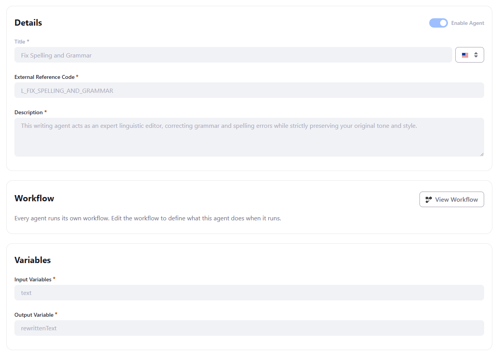
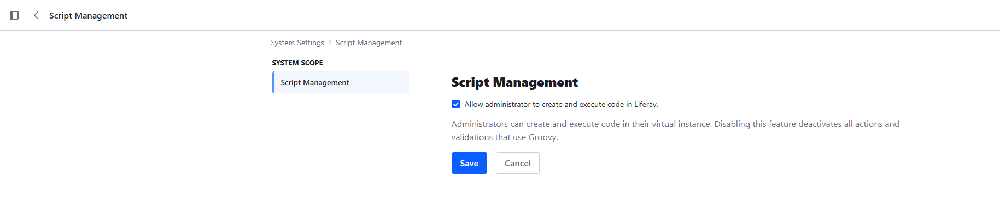
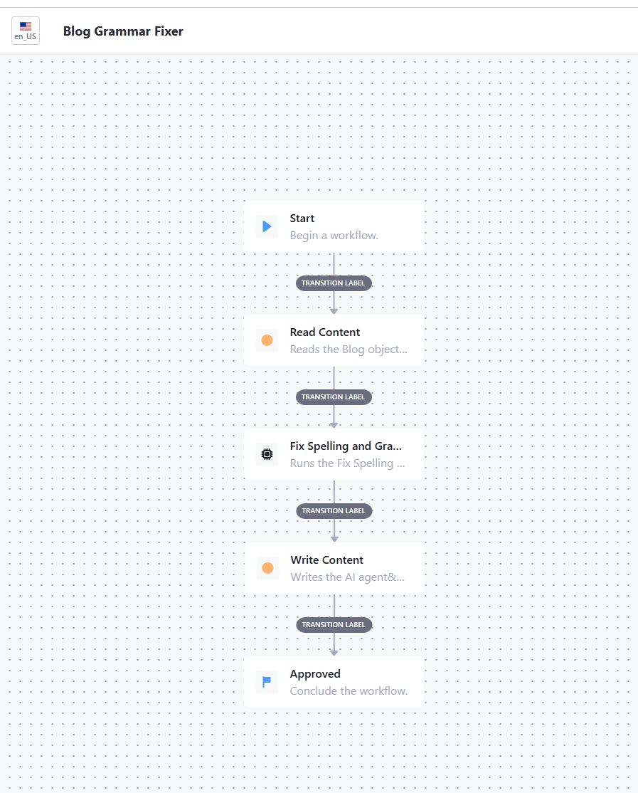
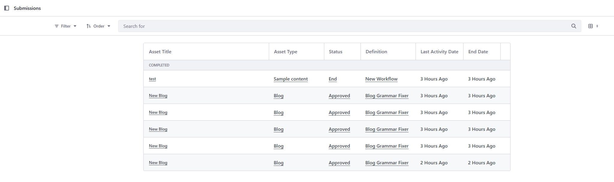

# Quick Start: Fixing Blog Grammar with an AI Hub Agent Triggered from a DXP Workflow

This quick start covers the **AI Hub Agent** node in Liferay's classic Kaleo
workflow engine: a workflow definition running inside DXP itself (the same
engine behind content approval processes) can synchronously invoke an AI Hub
agent as one of its steps, pass it data, and use what it returns.

The worked example is deliberately narrow: a Kaleo workflow attached to a
**Blog** object reads the blog's `Content` field, sends it to AI Hub's
built-in **Fix Spelling and Grammar** agent, and writes the corrected text
back — fully automated, no human approval step.

This quick start assumes you have already completed *AI Hub Quick Start 1 —
HTTP Requests* and *AI Hub Quick Start 2 — RAG*: AI Hub enabled and connected
to DXP, and an Internet-accessible HTTPS URL for your DXP environment.

## 1. Building blocks

### The `<ai-hub-agent>` Kaleo node

Liferay's core Kaleo workflow engine ships a node type dedicated to this:
`NodeType.AI_HUB_AGENT`, implemented by
`com.liferay.portal.workflow.kaleo.runtime.internal.node.AIHubAgentNodeExecutor`.
It sits in a workflow definition next to the familiar `state`/`task`/`condition`
nodes, and is gated by the **same feature flag as the rest of AI Hub**
(`LPD-62272`).

When the workflow engine enters this node, it:

1. Obtains an authorization token for the AI Hub Cell connection configured
   on this DXP instance (the same connection you set up in Quick Start 1).
2. Builds a JSON payload from every `Boolean`/`Number`/`String` entry
   currently in the Kaleo workflow's context — this becomes the `context`
   the agent receives.
3. POSTs it, **synchronously**, to AI Hub's `agent-instances` endpoint and
   waits for the response.
4. Merges every key of the JSON response back into the workflow context,
   then transitions to the node's single outgoing transition.

The node's own settings, configured directly in the workflow definition XML,
are:

| Setting | Purpose |
| --- | --- |
| `agent-definition-external-reference-code` | Which AI Hub agent to invoke |
| `timeout` | How long to wait for the agent's response, in milliseconds |

> ⚠️ **Set a realistic `timeout`.** The default fallback if you omit the
> setting is 120000 (120s), which is reasonable — but if you set an explicit
> value, don't set it too low. A short-lived agent's own internal workflow
> (its LLM node, and any RAG or HTTP Request node it calls first) can easily
> take several seconds. `1000` (1 second) will fail almost every real
> invocation with a `SocketTimeoutException`, with no useful error beyond
> "Read timed out". `60000` is a safe starting point.

### How data moves between the two workflows

The Kaleo `workflowContext` — the same `Map<String, Serializable>` a Kaleo
workflow already carries from node to node — is the **entire** communication
channel between the DXP workflow and the AI Hub agent's own, separate
workflow. There is no other wiring: no dedicated input/output mapping UI on
the `ai-hub-agent` node itself, nothing to configure beyond the agent's ERC
and the timeout.

- **DXP → AI Hub**: every `Boolean`, `Number`, or `String` currently sitting
  in `workflowContext` when the node fires gets sent as the agent's
  `context` payload. Inside the agent's own workflow, each of those becomes
  an ordinary input variable, referenced the normal way (`{{variableName}}`
  in a prompt or a node's URL/body) — the agent has no way to tell that the
  value came from a Kaleo workflow rather than a chat message or a manual
  test.
- **AI Hub → DXP**: the agent's result is merged back into that same
  `workflowContext` before the workflow continues to its next node, as the
  `output` variable — today, an agent invoked this way returns exactly one
  output value, always under that literal key, regardless of how its
  Output Variable is actually named in Agent Builder. If an agent's
  workflow produces more than one piece of data you need, you currently
  have to combine it into that single returned value yourself (for
  example, as one JSON string) and parse it apart on the DXP side.

This is why, in this quick start's `read-content` action, setting
`workflowContext.put("text", ...)` is enough for the agent's `text` input
variable to be populated — no separate step declares that mapping anywhere.

### Groovy actions vs. a `workflowAction` client extension

The `read-content` and `write-content` steps in this quick start are Groovy
`<action>` scripts, running in-process inside DXP. That isn't the only way
to script a Kaleo workflow step — Liferay also supports a `workflowAction`
**client extension**: an external microservice (a Spring Boot app, for
example) that DXP calls out to over HTTP for that step, authenticated with a
token delegated to a specific user rather than running under the enclosing
request's own identity.

A client extension is the more production-shaped option — real code in a
proper IDE with its own tests, deployed and versioned independently of the
workflow definition — and, because of that per-user delegated token, it
avoids some of the identity limitations described in Section 3. It also
means more setup: a separate deployable artifact, its own OAuth2
application, and routes wiring it to the workflow definition.

For a quick start, a Groovy action is the fastest path to something working
end to end: paste the script directly into the action in the Designer, no
separate deployment, no additional OAuth2 configuration. That's the
approach used throughout this guide; reach for a `workflowAction` client
extension once similar logic is heading toward production.

### The built-in "Fix Spelling and Grammar" agent

AI Hub ships a ready-to-use agent for this exact scenario
(external reference code `L_FIX_SPELLING_AND_GRAMMAR`). Its contract, visible
in **AI Hub → Agent Builder**:



| Field | Value |
| --- | --- |
| Input Variables | `text` |
| Output Variable | `rewrittenText` (as named in Agent Builder — see below) |

> ⚠️ **Don't trust the Output Variable's name for what key to read.** Per
> the note above, whatever this agent's Output Variable is actually named
> in Agent Builder, the value still arrives in `workflowContext` under the
> fixed key `output`. Reading the field's configured name instead (a very
> reasonable first guess) silently returns `null` — no error, the workflow
> completes normally, and nothing gets updated. Always confirm by logging
> the whole workflow context after the node runs (see Step 5) rather than
> assume.

## 2. Step-by-step tutorial

### Step 1 — Prerequisites

- AI Hub enabled and connected to DXP (Quick Start 1, Steps 2–4).
- The **Fix Spelling and Grammar** agent enabled in **AI Hub → Agent Builder**.
- A DXP object (native content type or a custom Object) with a text field to
  correct. This quick start uses a custom **Blog** object with a `Content`
  field (Rich Text, field name `content`, marked **Localizable**).
- Groovy scripting enabled: **Control Panel → Configuration → System
  Settings → Script Management**, check **"Allow administrator to create
  and execute code in Liferay."** This is what lets the `read-content` and
  `write-content` actions' Groovy scripts run at all — with it off, every
  action and validation that uses Groovy is silently deactivated.

  
- If your DXP environment sits behind a tunnel such as ngrok (see Quick
  Start 1's Prerequisites), make sure it's configured to let Liferay resolve
  its own public URL correctly — see the note below. Several of the node's
  internal HTTP calls (including a call DXP makes to itself to mint a token)
  depend on this being right.

#### `portal-ext.properties` — trusting the reverse proxy

The `AIHubAgentNodeExecutor` node needs DXP to know its own correct public
URL, including when it calls **itself** (`/o/ai-hub-cell/v1.0/authorization-tokens`)
to obtain that token. Behind a tunnel like ngrok, this means telling Liferay
to trust the tunnel's forwarded headers instead of guessing from its own
local Tomcat port — otherwise the port DXP is actually listening on
(commonly `8080`) leaks into URLs that are supposed to be the tunnel's
public, portless HTTPS address, and outbound self-calls fail or hang.

Add to `portal-ext.properties`:

```properties
web.server.http.port=80
web.server.https.port=443

web.server.forwarded.protocol.enabled=true
web.server.forwarded.host.enabled=true
web.server.forwarded.port.enabled=true
```

Two things worth calling out explicitly:

- **`web.server.https.port=443`** (not `-1`) matters on its own, separately
  from the `forwarded.*` properties: some of the node's internal URL
  resolution happens on a background thread with **no active HTTP request**
  to read a forwarded-port header from in the first place (see the box
  below) — in that situation only a *static* port value is used at all.
  Setting it explicitly to the real HTTPS port (443) means no port suffix
  ever gets appended to the resolved URL, matching what a bare `https://`
  tunnel address actually needs.
- **Don't combine `web.server.forwarded.host.enabled=true` with a
  manually-set `web.server.host`, or `forwarded.protocol.enabled=true` with a
  manually-set `web.server.protocol`.** Liferay's own documentation for
  these properties is explicit that the static property must be left at its
  default when the corresponding `forwarded.*.enabled` flag is on — setting
  both leads to inconsistent, hard-to-diagnose URL resolution.

> ⚠️ **Why the port matters even though the call never leaves the machine.**
> `AIHubAgentNodeExecutor` runs on a background executor thread, detached
> from any incoming HTTP request — there is no live request whose
> `X-Forwarded-Port` header it could read, even with `forwarded.port.enabled`
> on. Without a static `web.server.https.port`, URL resolution falls back to
> the JVM's *actual* listening port (e.g. `8080`), which then gets appended
> to what should be a bare `https://your-tunnel-host` address, and the
> resulting call fails. A generous node `timeout` (see above) won't fix
> this — no amount of waiting produces a valid response for a malformed
> URL. Restart Tomcat after changing `portal-ext.properties`; it's only read
> at startup.

### Step 2 — Create the workflow definition

In **Control Panel → Workflow → Workflow Designer**, create a new workflow
with this shape:

```text
Start
  |
  v
Read Content   (state, Groovy action onEntry)
  |
  v
Fix Spelling and Grammar   (ai-hub-agent)
  |
  v
Write Content   (state, Groovy action onEntry)
  |
  v
Approved (terminal)
```

Full definition XML:

```xml
<?xml version="1.0"?>

<workflow-definition
	xmlns="urn:liferay.com:liferay-workflow_7.4.0"
	xmlns:xsi="http://www.w3.org/2001/XMLSchema-instance"
	xsi:schemaLocation="urn:liferay.com:liferay-workflow_7.4.0 http://www.liferay.com/dtd/liferay-workflow-definition_7_4_0.xsd"
>
	<name>Blog Grammar Fixer</name>
	<state>
		<name>created</name>
		<metadata>
			<![CDATA[
				{
					"xy": [
						300,
						60
					]
				}
			]]>
		</metadata>
		<initial>true</initial>
		<labels>
			<label language-id="en_US">Start</label>
		</labels>
		<transitions>
			<transition>
				<labels>
					<label language-id="en_US">Transition Label</label>
				</labels>
				<name>read-content</name>
				<target>read-content</target>
				<default>true</default>
			</transition>
		</transitions>
	</state>
	<state>
		<name>read-content</name>
		<description>Reads the Blog object entry's content field into the workflow context.</description>
		<metadata>
			<![CDATA[
				{
					"xy": [
						300,
						220
					]
				}
			]]>
		</metadata>
		<actions>
			<action>
				<name>Read Blog content</name>
				<script>
					<![CDATA[
						import com.liferay.object.service.ObjectEntryLocalServiceUtil
						import com.liferay.portal.kernel.util.GetterUtil

						long objectEntryId = GetterUtil.getLong(workflowContext.get("entryClassPK"))

						def objectEntry = ObjectEntryLocalServiceUtil.getObjectEntry(objectEntryId)

						def contentI18n = (Map) objectEntry.getValues().get("content_i18n")

						workflowContext.put("text", (String) contentI18n?.get("en_US"))
					]]>
				</script>
				<script-language>groovy</script-language>
				<priority>1</priority>
				<execution-type>onEntry</execution-type>
			</action>
		</actions>
		<labels>
			<label language-id="en_US">Read Content</label>
		</labels>
		<transitions>
			<transition>
				<labels>
					<label language-id="en_US">Transition Label</label>
				</labels>
				<name>review</name>
				<target>review</target>
				<default>true</default>
			</transition>
		</transitions>
	</state>
	<ai-hub-agent>
		<name>review</name>
		<description>Runs the Fix Spelling and Grammar AI Hub agent.</description>
		<metadata>
			<![CDATA[
				{
					"xy": [
						300,
						380
					]
				}
			]]>
		</metadata>
		<labels>
			<label language-id="en_US">Fix Spelling and Grammar</label>
		</labels>
		<agent-definition-external-reference-code>L_FIX_SPELLING_AND_GRAMMAR</agent-definition-external-reference-code>
		<timeout>60000</timeout>
		<transitions>
			<transition>
				<labels>
					<label language-id="en_US">Transition Label</label>
				</labels>
				<name>write-content</name>
				<target>write-content</target>
				<default>true</default>
			</transition>
		</transitions>
	</ai-hub-agent>
	<state>
		<name>write-content</name>
		<description>Writes the AI agent's corrected text back onto the Blog object entry.</description>
		<metadata>
			<![CDATA[
				{
					"xy": [
						300,
						540
					]
				}
			]]>
		</metadata>
		<actions>
			<action>
				<name>Write Blog content</name>
				<script>
					<![CDATA[
						import com.liferay.object.service.ObjectEntryLocalServiceUtil
						import com.liferay.portal.kernel.service.ServiceContext
						import com.liferay.portal.kernel.util.GetterUtil
						import com.liferay.portal.kernel.util.Validator

						long objectEntryId = GetterUtil.getLong(workflowContext.get("entryClassPK"))

						def objectEntry = ObjectEntryLocalServiceUtil.getObjectEntry(objectEntryId)

						String rewrittenText = (String) workflowContext.get("output")

						if (Validator.isNotNull(rewrittenText)) {
							def values = new HashMap<>(objectEntry.getValues())

							values.put("content_i18n", ["en_US": rewrittenText])

							ObjectEntryLocalServiceUtil.updateObjectEntry(
								kaleoInstanceToken.getUserId(),
								objectEntryId,
								objectEntry.getObjectEntryFolderId(),
								values,
								new ServiceContext())
						}
					]]>
				</script>
				<script-language>groovy</script-language>
				<priority>1</priority>
				<execution-type>onEntry</execution-type>
			</action>
		</actions>
		<labels>
			<label language-id="en_US">Write Content</label>
		</labels>
		<transitions>
			<transition>
				<labels>
					<label language-id="en_US">Transition Label</label>
				</labels>
				<name>approve</name>
				<target>approved</target>
				<default>true</default>
			</transition>
		</transitions>
	</state>
	<state>
		<name>approved</name>
		<metadata>
			<![CDATA[
				{
					"terminal": true,
					"xy": [
						300,
						700
					]
				}
			]]>
		</metadata>
		<labels>
			<label language-id="en_US">Approved</label>
		</labels>
		<actions>
			<action>
				<name>approve</name>
				<status>0</status>
				<execution-type>onEntry</execution-type>
			</action>
		</actions>
	</state>
</workflow-definition>
```



> ⚠️ **The Workflow Designer's own parser is stricter than the Kaleo XSD.**
> A hand-simplified XML that omits `<metadata>` (the `xy` canvas position)
> on a node, or `<labels>` on a transition, deploys and runs fine through
> the API — but re-opening or re-saving it through the Designer UI can throw
> a client-side JavaScript error (`Cannot read properties of undefined
> (reading '0')`, from the canvas trying to read `xy[0]` on a missing
> `metadata` block) and refuse to save. Always keep `<metadata>` and
> transition `<labels>` on every node, even ones you write by hand.

> ⚠️ **Remove the `<version>` tag before pasting a workflow definition
> into the Designer.** Every version of a workflow definition already
> deployed on your instance has its own `<version>` number, assigned by
> DXP — pasting in XML that includes one (the XML above included, and any
> XML you export from an existing definition through the Designer) can
> conflict with what's already there instead of being treated as a new
> revision. Strip the `<version>...</version>` line before pasting either
> a fresh definition or an update to an existing one; DXP assigns the next
> version number itself on save.

### Step 3 — Reading a localized field

`ObjectEntryLocalServiceUtil.getObjectEntry(objectEntryId).getValues()`
returns a `Map<String, Serializable>` that, for a **localized** field
(`Content` here — `Localizable` is checked on its Content Structure field
definition), actually contains *two* related entries: a flattened `content`
key, and the raw per-language map under `content_i18n`
(`<fieldName>_i18n` — the same key Step 5 writes to).

The flattened `content` key is convenient, but it resolves to the object
**entry's own default language** (`objectEntry.getDefaultLanguageId()`) —
not necessarily `en_US`, and not necessarily the locale you actually want.
To read a specific locale reliably, go through the `_i18n` map directly,
the same way Step 5 writes to it:

```groovy
def contentI18n = (Map) objectEntry.getValues().get("content_i18n")

workflowContext.put("text", (String) contentI18n?.get("en_US"))
```

`entryClassPK` — the object entry's ID — is one of several standard keys
Kaleo automatically populates in the workflow context when the workflow is
attached to an object; no extra wiring needed to get it.

### Step 4 — The AI Hub Agent node

Configure the `ai-hub-agent` node's settings (`agent-definition-external-reference-code`
and `timeout` — see Step 2's XML) exactly as documented in *Building blocks*
above. Nothing else is required on this node — no assignment, no additional
input mapping. The agent reads `text` from the context automatically, and
writes `output` back into it.

### Step 5 — Writing a localized field back

This is the step that doesn't work the same way as reading. Writing a
localized field's value requires two things `getValues()`'s convenient flat
view hides from you:

1. The key isn't the field's own name (`content`) — it's
   `<fieldName>_i18n` (`content_i18n` here). This is a fixed, mechanical
   naming rule (`ObjectField.getI18nObjectFieldName()` returns
   `getName() + "_i18n"`), not something configured per field.
2. The value under that key must be a `Map<String, String>` keyed by
   **language ID** (`"en_US"`, not a `Locale` object), not a plain `String`.

```groovy
def values = new HashMap<>(objectEntry.getValues())
values.put("content_i18n", ["en_US": rewrittenText])

ObjectEntryLocalServiceUtil.updateObjectEntry(
	kaleoInstanceToken.getUserId(),
	objectEntryId,
	objectEntry.getObjectEntryFolderId(),
	values,
	new ServiceContext())
```

Passing `values.put("content", rewrittenText)` instead — the natural thing
to try, matching what worked for reading — compiles, runs, and returns no
error at all: the write silently updates nothing, because
`ObjectEntryLocalServiceImpl` explicitly strips the bare field name (and the
`_i18n` key, if present) from what it writes to the entry's main table for
any field it knows is localized, and only consults the `_i18n` map for the
dedicated localization table.

> ✅ **How to verify this instead of guessing.** Log the entire
> `workflowContext` right after the `ai-hub-agent` node, before assuming
> what key or shape a value has:
>
> ```groovy
> import com.liferay.portal.kernel.log.Log
> import com.liferay.portal.kernel.log.LogFactoryUtil
>
> Log _log = LogFactoryUtil.getLog("BlogGrammarFixer")
> _log.error("BlogGrammarFixer workflowContext: " + workflowContext)
> ```
>
> `_log.error(...)` is used deliberately here (not `.info()`) so the line
> is visible without first configuring **Server Administration → Log
> Levels** — remove it once you've confirmed the real key names and shapes
> for your own agent and fields.

### Step 6 — Attach the workflow and test

Same as any Kaleo workflow: **Control Panel → Objects → Blog → Details →
enable workflow → select "Blog Grammar Fixer"**, then create or edit a Blog
entry with a deliberately misspelled `Content` field. Check
**Control Panel → Workflow → Submissions** for the instance's status
(`Approved` once the workflow completes), then re-open the entry — the
`Content` field should show the corrected text.



## 3. Security context: which identity do RAG and HTTP Request calls use?

This matters as soon as the agent you invoke from a Kaleo workflow does more
than call an LLM — if its own internal workflow includes a **RAG** node
(Search Blueprint) or an **HTTP Request** node (Quick Start 1 and 2), that
node's outbound call needs *some* identity to authenticate as.

**When triggered from a Kaleo workflow, that identity is the Virtual
Instance's default user** — not the content's author, and not whoever is
logged into DXP at the time — **with whatever permissions that account
happens to have.** Practical consequences:

- A RAG retrieval scoped to content the default user can't see returns
  nothing — not an error, just an empty or incomplete result, which can
  look like a Search Blueprint or indexing problem when it's actually a
  permissions problem.
- An HTTP Request node calling a DXP endpoint that requires elevated
  permissions gets a `403`, the same class of error covered in Quick
  Start 1 Step 6.
- This is a different security model from a chat-triggered invocation,
  where the agent acts with the identity of whichever user is actually
  signed in and talking to it.

This is a current limitation of triggering an agent from a Kaleo workflow,
not a permanent design — expect AI Hub to offer more control over which
identity an agent acts as in this scenario as the feature matures. For now,
design around the default user's actual permissions: grant it exactly what
this workflow needs, and no more.

## 4. Recommendations

1. Remember `workflowContext` is the *only* channel between a Kaleo
   workflow and an AI Hub agent's own workflow — every `Boolean`/`Number`/
   `String` in it becomes an agent input variable, and whatever the agent
   returns is merged straight back into it.
2. An agent invoked this way currently returns exactly one output variable,
   always under the literal key `output` — regardless of the Output
   Variable's configured name in Agent Builder. Don't assume the configured
   name is the key to read.
3. Set a generous, explicit `timeout` on every `ai-hub-agent` node — a
   short-lived agent workflow (LLM plus any RAG/HTTP Request node) can
   easily take several seconds.
4. If DXP sits behind a reverse-proxy tunnel (ngrok or similar), configure
   `web.server.https.port` and the `web.server.forwarded.*.enabled`
   properties *together*, correctly — this affects background, request-less
   calls the node makes to itself, not just ordinary page URLs.
5. For a **localized** field through `ObjectEntryLocalServiceUtil`, read
   *and* write through the `<fieldName>_i18n` key (a `Map<languageId,
   value>`) rather than the flattened field name — the flattened key
   resolves to the object entry's own default language, not necessarily
   the locale you actually want.
6. If an agent's RAG or HTTP Request node needs to see private content or
   call a protected endpoint, remember it's acting as the **default user**
   when triggered from a Kaleo workflow — design the target Search Blueprint
   scope and the target endpoint's required OAuth2 scope around that
   account's actual permissions, not the workflow's or the content's owner.
7. Log the full `workflowContext` (via `_log.error`, temporarily) the first
   time you wire a new agent into a workflow, rather than assume a variable
   name or a field's write shape.
8. Keep `<metadata>` (with `xy`) and transition `<labels>` on every node,
   even in a hand-written or simplified workflow definition XML — the
   Workflow Designer's own save path is stricter than what a raw API deploy
   accepts.
9. Strip the `<version>` tag from any workflow definition XML before
   pasting it into the Designer — whether it's from this guide or exported
   from one of your own definitions — and let DXP assign the version number
   on save.

## 5. Other business use cases for this pattern

The worked example fixes spelling and grammar on a Blog entry, but the
underlying mechanism — a Kaleo node calling an AI Hub agent synchronously,
exchanging data through `workflowContext` — applies to any content-object
workflow that can benefit from an LLM step:

1.  **Auto-tagging / categorization** — have the agent read an entry's
    content and return suggested tags or categories, written back the same
    way the corrected text is here.
2.  **SEO metadata generation** — generate a meta title/description from
    the content, feeding into an SEO Studio-managed field.
3.  **Translation draft generation** — leverage the same `_i18n` write
    pattern to populate a non-default locale with a machine-translated
    draft, routed through a real, human-reviewed Task (not auto-completed)
    before publication.
4.  **Content moderation / PII gate** — have the agent flag risky or
    sensitive content, and branch the workflow with a `<condition>` node
    on its verdict instead of always auto-approving.
5.  **Support ticket classification / routing** — call an agent to
    classify an incoming ticket and set a routing field, before the
    workflow assigns it to the right team.
6.  **Document summarization for approval queues** — generate a short
    summary alongside a long document so reviewers in a Task node can
    triage faster.
7.  **RAG inside a Kaleo-triggered agent** — combine this pattern with
    Quick Start 2: the agent invoked from the workflow performs a RAG
    lookup (e.g. against a policy knowledge base) before returning its
    output, so a governance workflow can ground its decision in existing
    documentation.

## References

- Previous quick starts in this series: *AI Hub Quick Start 1 — HTTP
  Requests*, *AI Hub Quick Start 2 — Building a RAG Chatbot*
- Liferay AI Hub integration: [learn.liferay.com/w/ai-hub/integrating-ai-hub-with-liferay-dxp](https://learn.liferay.com/w/ai-hub/integrating-ai-hub-with-liferay-dxp)
- Object Storage / `ObjectEntryLocalServiceUtil`: Control Panel → Objects
