# Quick Start: Calling an AI Hub Chatbot from JavaScript — a Conversational Claim Form

This quick start calls a **Liferay AI Hub** chatbot from **JavaScript running
in the browser**, on a Liferay DXP page. The use case is a claim declaration
form: instead of facing fifteen fields, the customer explains in their own
words what happened. An AI Hub agent extracts the values, asks the missing
details, and fills the form. When everything is collected, the form appears,
pre-filled, and the customer reviews it and submits it with Liferay's native
submit button.

The previous quick starts called AI Hub from AI Hub itself (Quick Starts 1, 2
and 4) or from the DXP server (Quick Start 3, a Kaleo workflow). Here the
caller is the **page**, which brings three things the other patterns don't
have:

-   **the page context** — here, the fields of a Form Container and the
    values typed so far;
-   **the user's identity** — the call is made on behalf of the signed-in
    user, not of a technical account;
-   **a free user interface** — the agent is not displayed as a generic chat
    widget: its JSON answer drives a UI built for the task (progress bar,
    chips listing the fields filled, quick replies, form reveal).

Nothing needs to be built or deployed. The JavaScript module is published on
GitHub Pages and registered through the Liferay UI as a **JS Import Maps
Entry** client extension; the fragment, the Object and its picklists are
imported from files.

## 1. The scenario

An insurance company publishes a **Claims Portal** with a *Declare a Claim*
page. The page holds a Form Container mapped to a **Claim Declaration**
Object: claim type, insured asset, severity, policy number, policyholder
details, date and description of the incident, damage estimate, third party,
police report, and up to three photos plus one supporting document.

With the assistant, the page first shows a conversation:

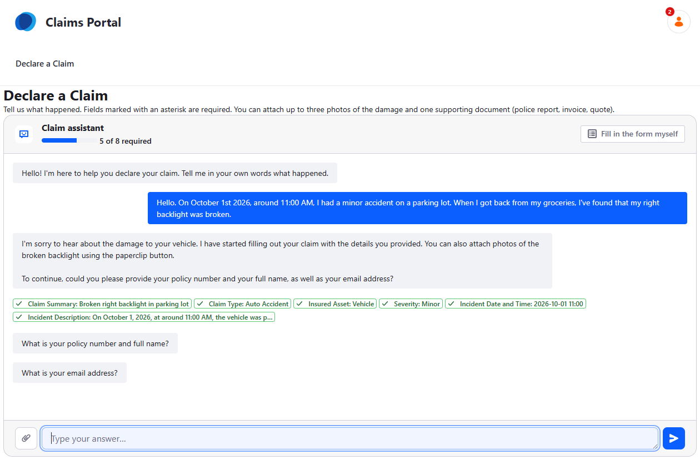

From a single sentence, the agent filled the claim summary, claim type,
insured asset, severity, incident date and time and incident description. It
then asks for the required details it cannot deduce — policy number, name,
email — two questions at a time. The progress bar counts the required fields
filled.

When the agent considers the declaration complete, and the browser has
checked that no required field is empty, the conversation gives way to the
native form:

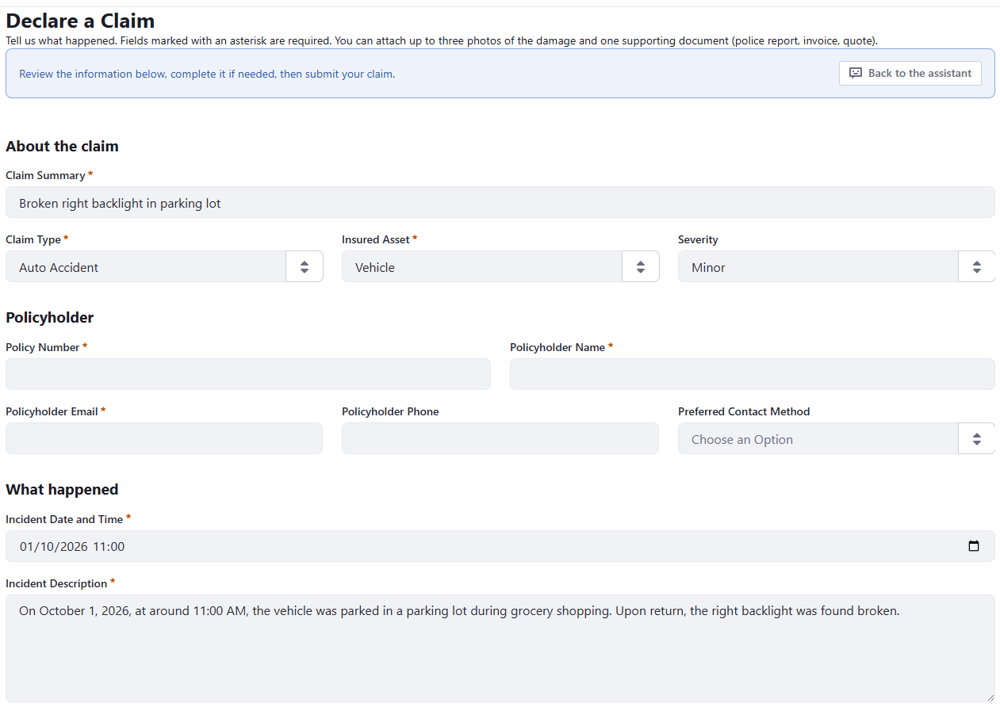

The customer can still edit any field, go back to the assistant, or submit.
The **"Fill in the form myself"** button skips the assistant at any time.

The video below shows a complete declaration, from the first message to the
submitted form (2 min):

<video src="videos/claim-assistant.mp4" controls preload="metadata" width="100%">
  <a href="videos/claim-assistant.mp4">Watch the claim assistant demo (videos/claim-assistant.mp4)</a>
</video>

## 2. Building blocks

### The pieces and where they live

| Piece | Where it lives | Role |
| --- | --- | --- |
| `claim-chat-assistant.js` | GitHub Pages ([ai-hub-claim-chat-assistant](https://github.com/fabian-bouche-liferay/ai-hub-claim-chat-assistant)) | The `<claim-chat-assistant>` custom element: reads the form, talks to AI Hub, fills the fields |
| *JS Import Maps Entry* client extension | DXP, created in the UI | Maps the bare specifier `claim-chat-assistant` to the GitHub Pages URL |
| *Claim Chat Form Wrapper* fragment | DXP, imported from `resources/claim-chat-fragments.zip` | Holds the element and a drop zone for the Form Container; carries the configuration |
| *Claim Declaration* Object and its picklists | DXP, imported from `resources/` | The data model behind the form |
| Agent and chatbot | AI Hub, created in the UI | The prompt and the JSON contract |

The fragment does almost nothing: its HTML renders the element and the drop
zone, and its JavaScript runs one line, `import('claim-chat-assistant')`,
outside of edit mode. The browser resolves that bare specifier through the
**import map** Liferay generates from the JS Import Maps Entry client
extensions — which is why registering a URL in the UI is enough.

### Reading the form

The element never needs to be told which fields the form has. It reads them
from the Form Container's DOM, through the accessibility attributes Liferay
renders on every form field fragment:

| Property | Source |
| --- | --- |
| `name` | `data-field-name`, without the `ObjectField_` prefix |
| `type` | `data-field-type` (`text`, `long-text`, `select`, `date-time`, `number`, `boolean`, `file`) |
| `label` | the first id in the control's `aria-labelledby` |
| `helpText` | the control's `aria-describedby` |
| `required` | `required` / `aria-required` |
| `options` | the `[role="option"]` items (`data-option-value`, `data-option-label`) |

Two consequences:

-   the same element works with **any** Form Container mapped to **any**
    Object: nothing in the code is specific to claims, except the default
    texts;
-   what you change in the Page Editor — removing a field, making it
    required, adding a help text — changes what the agent receives on the
    next page load.

### Calling AI Hub from the browser

The element uses the same chat API as AI Hub's own embeddable chatbot:

1.  **Authentication** — it POSTs to DXP's
    `/o/ai-hub-cell/v1.0/authorization-tokens` with the page's CSRF token
    (`Liferay.authToken`). DXP requests the tokens from AI Hub, using the
    connection configured in *Instance Settings → AI Hub*, so the browser
    never holds the Client Secret. For a signed-in user, DXP returns an access token
    and a user token, sent to AI Hub as `Authorization: Bearer …` and
    `Liferay-AI-Hub-Cell-On-Behalf-Of: …`: the conversation runs **on behalf
    of that user**. For a guest, no token is issued and the conversation is
    anonymous.
2.  **Subscription** — it opens a Server-Sent Events stream on
    `<AI Hub URL>/o/ai-hub/v1.0/chats/subscribe`. The first `Subscribe`
    event carries the chat's external reference code.
3.  **Messages** — every customer message is POSTed to
    `/o/ai-hub/v1.0/chats/by-external-reference-code/{chat ERC}/messages`
    with the chatbot ERC, the text and a `context` object (see below).
4.  **Reply** — the answer arrives on the event stream as a `Chat Message
    Sent` event, or an `Agent Invocation Failed` event on error. Per-node
    progress events are ignored.

### The message protocol

Each message carries this `context`. The chatbot's Supervisor only sees the
message text, which it passes to the agent as `request`; the `context` keys
bypass it and land directly in the agent's workflow context, where the
nodes read them:

| Key | Content |
| --- | --- |
| `formSchema` | JSON array of the non-file fields: `name`, `label`, `type`, `required` (only when true), `helpText` (only when present), `options` as `"value=Label"` strings (just `"value"` when both are equal) |
| `formState` | JSON object of the values currently in the form; an attached file appears as its file name |
| `missingRequiredFields` | JSON array of the required field names still empty |
| `today` | the date and time spelled out, e.g. `Today is Friday, October 2, 2026 at 12:40 (Europe/Paris, UTC+02:00).` When the context is embedded in the text, this is the first line of the `[FORM CONTEXT]` block |
| `currentDate` | the visitor's local date, `YYYY-MM-DD` |
| `currentDateTime` | the visitor's local date and time, `YYYY-MM-DDTHH:mm` |
| `currentDayOfWeek` | e.g. `Friday` |
| `timeZone` | IANA zone and offset, e.g. `Europe/Paris (UTC+02:00)` |
| `locale` | the page language |

The call is **stateless** from the form's point of view: the whole form state
is sent on every turn. If the customer edits a field directly, the agent sees
it on the next message.

The schema is kept **compact on purpose**. It is sent on every turn, and its
size drives the response time. Measured on a test instance:

| `formSchema` sent | Size | Time per turn |
| --- | --- | --- |
| Full: every field, format hints, options as objects | 3,560 characters | about 40–45 s |
| Compact: no file fields, no format hints, `"value=Label"` options | 1,379 characters | 22–32 s |
| None | — | 12–17 s |

The formats each type expects are stated once in the agent's prompt instead
of being repeated in every message.

The agent must answer with one JSON object:

```json
{
  "message": "Conversational text shown to the customer",
  "fieldUpdates": {"claimType": "autoAccident", "incidentDateTime": "2026-10-01T11:00"},
  "questions": ["What is your policy number and full name?"],
  "suggestions": ["Yes", "No"],
  "complete": false
}
```

The browser does not trust it blindly:

-   a field name that is not in the form is ignored;
-   a `select` value must match one of the options (value or label), or it
    is rejected;
-   numbers are normalized (`1 250,50` becomes `1250.5`), dates are checked,
    and a date without a time gets `12:00`;
-   file fields are not in the schema and are never set by the agent, which
    cannot analyze files: the customer attaches files with the paperclip
    button and, for each file, picks the file field it belongs to (*Damage
    Photo 2*, *Supporting Document*…) on a card showing a thumbnail. Nothing
    is sent to the agent at that point: the file name shows up in
    `formState` with the next message;
-   the form is revealed only when `complete` is `true` **and** no required
    field is empty; otherwise the missing labels are listed in the chat;
-   an answer that is not JSON is shown as plain text and fills nothing.

Quick replies (`suggestions`) do not send anything on their own. Each click
toggles a selection, several can be selected, and they are sent together with
the typed text — for example `Auto Accident, Vehicle. It happened last
night.` The text box stays usable while the agent answers; only the Send
button waits for the reply.

## 3. Step-by-step tutorial

### Step 1 --- Prerequisites

You need:

-   Liferay DXP **2026.Q3 or later**, with the **AI Hub (LPD-62272)**
    feature flag enabled;
-   the AI Hub connection configured in **Control Panel → Instance Settings
    → AI Hub**, with the Client ID / Client Secret from AI Hub (Steps 2–4 of
    Quick Start 2);
-   access to Liferay AI Hub, with permission to create agents and chatbots;
-   a site to host the *Declare a Claim* page;
-   the files of this quick start's [`resources/`](resources/) folder.

The Instance Settings connection is required even though the agent itself
never calls DXP (it has no RAG and no HTTP Request node). The browser first
asks DXP for a token through the AI Hub Cell API, and **DXP obtains that
token from AI Hub** with the configured Client ID / Client Secret. Only then
does the browser call AI Hub.

> ⚠️ **A missing connection does not show as an error.** Without the AI Hub
> configuration in Instance Settings, the token request fails and the
> element falls back to an anonymous conversation: the assistant still
> works, but no longer on behalf of the signed-in user. The difference only
> shows once an agent relies on the user's identity (RAG, HTTP Request).
> Check that the `authorization-tokens` call returns `200` in DevTools.

### Step 2 --- Import the picklists

The Object's picklist fields reference their picklists by external reference
code, so the picklists must exist **before** the Object is imported.

In **Control Panel → Picklists**, open the action menu next to **Add
Picklist** and click **Import Picklist**. Import the five `ListType_*.json`
files of the `resources/` folder, one at a time:

| Picklist | Keys |
| --- | --- |
| Claim Type | `autoAccident`, `waterDamage`, `fire`, `theft`, `naturalDisaster`, `glassBreakage`, `liability`, `other` |
| Claim Insured Asset | `vehicle`, `home`, `personalBelongings`, `business` |
| Claim Severity | `minor`, `moderate`, `major`, `totalLoss` |
| Claim Contact Method | `email`, `phone`, `sms` |
| Claim Status | `submitted`, `underReview`, `additionalInfoRequired`, `approved`, `rejected`, `closed` |

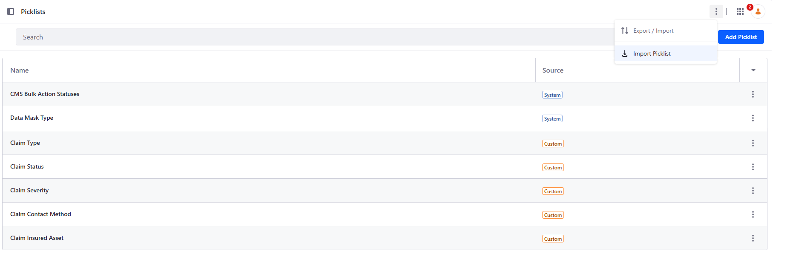

### Step 3 --- Import the Object folder

In **Control Panel → Objects**, open the action menu of **Object Folders**
and click **Import Object Folder**. Import
`Object_Folder_Claims_….json`.

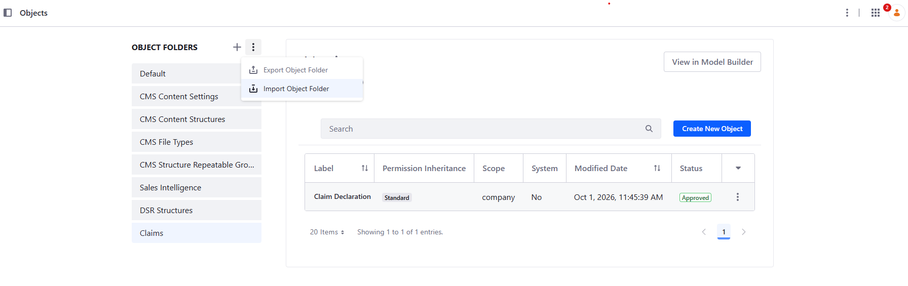

This creates the **Claims** folder and the **Claim Declaration** Object,
company-scoped. Its required fields are the claim summary, claim type,
insured asset, policy number, policyholder name and email, incident date and
time, and incident description. **Claim Status** is a state field defaulting
to `submitted`: it stays off the form.

Check that the Object is **published** before going further: a Form
Container can only be mapped to a published Object.

### Step 4 --- Register the client extension

In **Applications → Client Extensions**, click **New → JS Import Maps
Entry**.

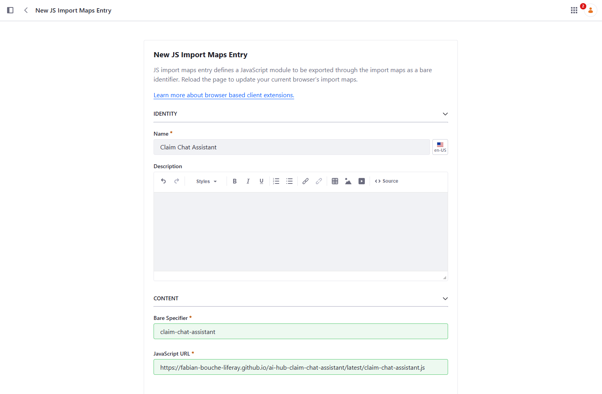

Configure:

| Field | Value |
| --- | --- |
| Name | `Claim Chat Assistant` |
| Bare Specifier | `claim-chat-assistant` |
| JavaScript URL | `https://fabian-bouche-liferay.github.io/ai-hub-claim-chat-assistant/latest/claim-chat-assistant.js` |

The **bare specifier must be exactly `claim-chat-assistant`**: it is the
name the fragment imports.

`latest/` follows the repository's main branch. To freeze the behavior
described in this tutorial, use a versioned URL instead, such as
`…/ai-hub-claim-chat-assistant/v1.0.0/claim-chat-assistant.js`. The
published versions are listed on the
[GitHub Pages index](https://fabian-bouche-liferay.github.io/ai-hub-claim-chat-assistant/).

> 💡 **Forcing a new version of the script.** Browsers and GitHub Pages cache
> the JavaScript file (GitHub Pages for about 10 minutes). When you know a
> new version has been published under the same URL — typically `latest/` —
> add a query parameter with a value that changes, such as a timestamp, to
> the client extension's JavaScript URL:
> `…/latest/claim-chat-assistant.js?t=20261002-1430`. The browser sees a new
> URL and downloads the file again. Change the value each time you need to
> pick up a new version.

### Step 5 --- Import the fragment

In your site, go to **Design → Fragments**, open the action menu of
**Fragment Sets** and click **Import**.

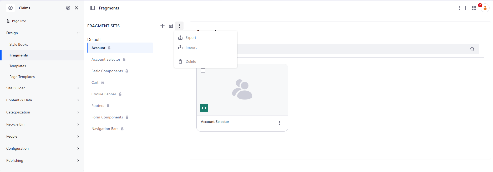

Select `resources/claim-chat-fragments.zip` and click **Import**. The same
zip is also attached to every
[release of the repository](https://github.com/fabian-bouche-liferay/ai-hub-claim-chat-assistant/releases).

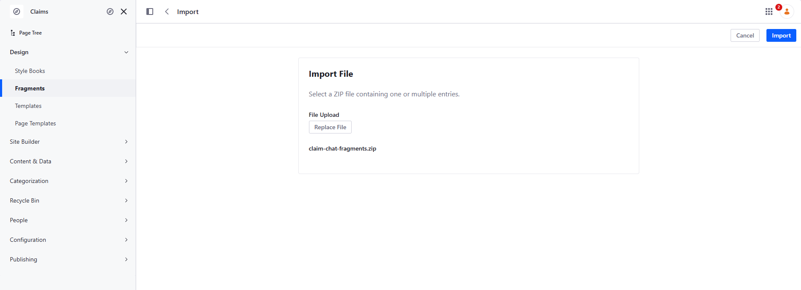

This adds the **Claim Chat Assistant** fragment set, with the **Claim Chat
Form Wrapper** fragment.

### Step 6 --- Create the agent

In **AI Hub → Agent Builder → Agents**, create an agent.

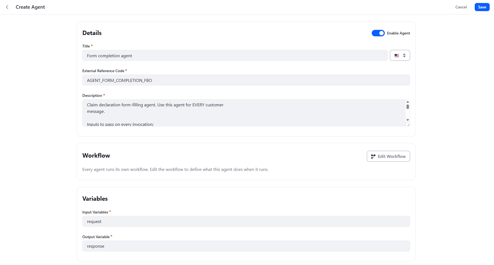

Configure:

``` text
Title: Form completion agent
External Reference Code: AGENT_FORM_COMPLETION_FBO
Input Variables: request
Output Variable: response
```

Description (read by the chatbot's Supervisor):

```text
Claim declaration form-filling agent. Use this agent for EVERY customer
message, passing the customer's message unchanged as request. Its output is a
JSON object consumed by a program: return it to the customer verbatim, with no
rewording, no summary and no added text.
```

Variables are declared in **two places**, with different meanings:

-   the agent definition's **Input Variables** are the arguments the
    Supervisor fills in when it calls the agent. The Supervisor only knows
    the customer's text, so list **`request` only**. Any other name listed
    here gets an empty string from the Supervisor, and that empty value
    replaces the real `context` value;
-   the LLM node's **Input Variables** (Step 7) list every value the prompt
    uses. They are read from the workflow context, where the `context` keys
    already are.

The description insists on returning the output verbatim: the JSON is read
by the browser, not by a person, and a rephrased answer fills nothing.

> ⚠️ **Click Save as Draft before clicking Edit Workflow.** Opening the
> workflow editor leaves the agent form: anything you entered on it that
> hasn't been saved is lost.

### Step 7 --- Configure the agent workflow

Click **Edit Workflow** and create a simple `Start → LLM → End` workflow.

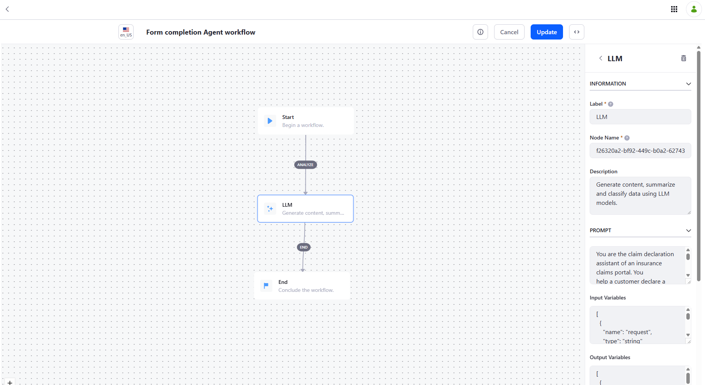

Select the **LLM** node and configure the following fields.

#### Input Variables

Every value the prompt uses, read from the workflow context: `request` from
the Supervisor, everything else from the message `context`.

```json
[
  {"name": "request", "type": "string"},
  {"name": "formSchema", "type": "string"},
  {"name": "formState", "type": "string"},
  {"name": "missingRequiredFields", "type": "string"},
  {"name": "today", "type": "string"},
  {"name": "currentDate", "type": "string"},
  {"name": "currentDateTime", "type": "string"},
  {"name": "currentDayOfWeek", "type": "string"},
  {"name": "timeZone", "type": "string"},
  {"name": "locale", "type": "string"}
]
```

#### Output Variables

```json
[
  {"name": "response", "type": "string"}
]
```

#### User Message

```text
Customer message:
{{request}}

Form schema (JSON):
{{formSchema}}

Values currently in the form (JSON):
{{formState}}

Required fields still empty before this turn (JSON):
{{missingRequiredFields}}

{{today}} Local date and time: {{currentDateTime}}, {{currentDayOfWeek}}, time zone {{timeZone}} (locale: {{locale}})
```

#### Prompt

```text
You are the claim declaration assistant of an insurance claims portal. You
help a customer declare a claim through a natural, empathetic conversation and
you fill in a web form on their behalf. You never submit the form: once
everything is collected, the customer reviews it and submits it.

INPUTS
- The customer message.
- The form schema: one entry per field with name, label, type (text,
  long-text, select, date-time, number, boolean), required (present only when
  true), an optional helpText, and for select fields options written
  "value=Label", or just "value" when value and label are the same.
- The values currently in the form. This is the source of truth for what is
  already known: the customer may have edited the form directly. Attached
  files appear there as their file name.
- The required fields still empty before this turn.
- The customer's local date, time, day of the week and time zone (the line
  starting "Today is"). Always use it to resolve relative dates and times
  such as "yesterday evening", "this morning" or "last Monday", and write the
  result in local time.

HOW TO FILL THE FORM
1. Extract every value you can from the customer message. Do not ask again for
   something already in the form, unless the customer contradicts it; then
   update it.
2. Only use field names that exist in the schema. Respect each field's type:
   - select: exactly one option value, the part before "=" (or the whole
     option when it has no "=");
   - date-time: YYYY-MM-DDTHH:mm, local time;
   - number: digits with a dot as decimal separator, no currency symbol;
   - boolean: true or false;
   - text and long-text: plain text.
3. Never invent a value. If something is ambiguous or uncertain, ask.
4. Write claimSummary yourself: a short, factual title of at most 80
   characters. Write incidentDescription as a clear, factual account based on
   what the customer said. Use the customer's language.
5. Files are not part of the schema and never part of fieldUpdates: you
   cannot see or analyze them. When it is relevant (photos of the damage,
   police report, invoice or quote), invite the customer once to attach them
   with the paperclip button. Do not ask again once file names appear in the
   form values.

HOW TO LEAD THE CONVERSATION
6. Ask at most two questions per turn, grouped logically, for example the
   policy number and the policyholder name together. Put each question in
   questions only: message is a short acknowledgement or transition and
   must not contain or rephrase the questions, because both are displayed.
7. Ask first for the required fields still empty, taking this turn's own
   updates into account. Then offer the useful optional details: severity,
   estimated damage amount, third party involved, police report and its
   number, phone and preferred contact method. Do not insist on an optional
   detail the customer does not know or does not want to give.
8. When a question is about a select field, put the labels of its options in
   suggestions. For a yes/no question, suggest "Yes" and "No". The customer
   may pick several suggestions and add text in the same message, for
   example "Auto Accident, Vehicle. It happened last night": read all of it.
9. Be warm and concise. Acknowledge what happened before asking anything.
   Reply in the customer's language.
10. Set complete to true only when no required field is empty after your
    updates and the optional details have been offered. Then tell the customer
    that the form is ready, that they should review it and submit it.

OUTPUT
Answer with ONLY one JSON object, without Markdown and without any text before
or after it:
{
  "message": "<short acknowledgement, without the questions>",
  "fieldUpdates": {"<fieldName>": <value>},
  "questions": ["<follow-up question>"],
  "suggestions": ["<quick reply>"],
  "complete": false
}
Use {} and [] when there is nothing to report.
```

The prompt splits the work with the browser: the agent decides **what** to
fill and **what** to ask; the browser checks **whether** each value fits the
field and **whether** the form is really complete. Neither side has to be
perfect for the result to be safe.

Click **Update**, then save and enable the agent.

### Step 8 --- Create the chatbot

In **AI Hub → Chatbots**, create a chatbot and assign the agent to it.

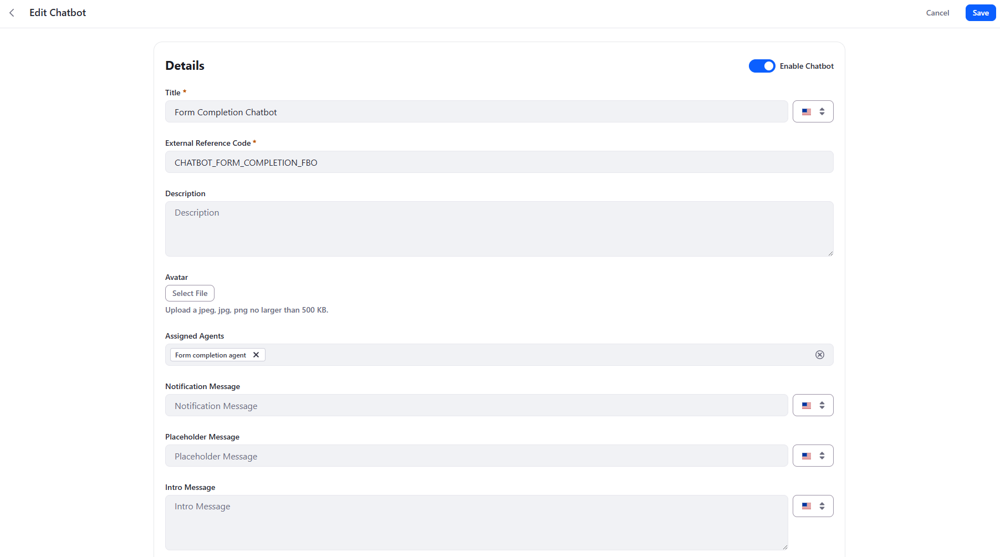

``` text
Title: Form Completion Chatbot
External Reference Code: CHATBOT_FORM_COMPLETION_FBO
Assigned Agents: Form completion agent
```

Assign **only this agent**: with a single agent, the Supervisor always
routes to it. Enable the chatbot and save. Leave the intro message empty:
the element shows its own welcome message, configured on the fragment.

### Step 9 --- Build the page

Create a content page, for example **Declare a Claim**, and in the Page
Editor:

1.  Drop the **Claim Chat Form Wrapper** fragment. In edit mode, it shows a
    hint instead of the assistant, so the form stays editable.
2.  Drop a **Form Container** into the wrapper's drop zone and map it to the
    **Claim Declaration** Object. Liferay generates one field fragment per
    Object field; arrange them as you like — the screenshot groups them
    under *About the claim*, *Policyholder* and *What happened* headings.
3.  Select the wrapper and configure it in the **General** tab:

| Field | Value |
| --- | --- |
| Chatbot External Reference Code | `CHATBOT_FORM_COMPLETION_FBO` |
| AI Hub URL | `https://ai.hub.liferay.com` (your AI Hub origin) |
| Welcome Message | The first assistant message, shown without calling the agent |
| Embed Form Context in Message Text | Unchecked (default): the context reaches the agent on its own (Step 6) |

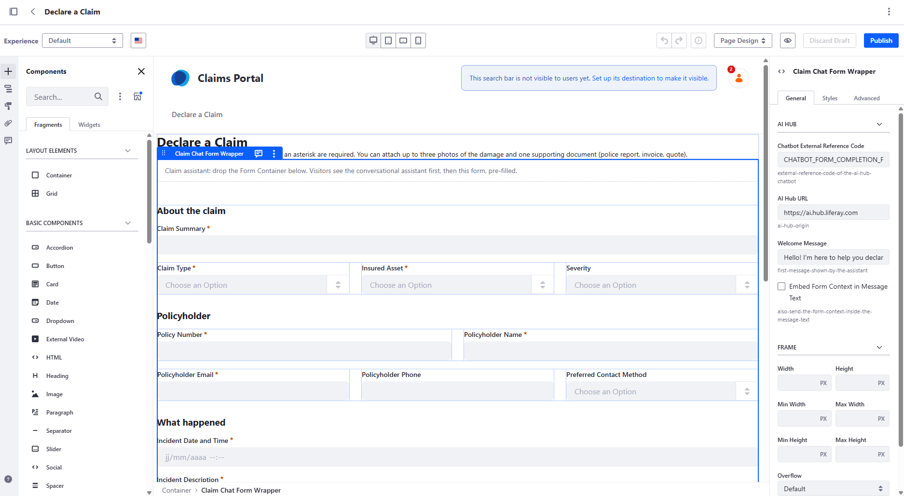

Publish the page.

### Step 10 --- Test it

Open the published page and describe a claim in one sentence, for example:

> Hello. On October 1st 2026, around 11:00 AM, I had a minor accident on a
> parking lot. When I got back from my groceries, I've found that my right
> backlight was broken.

Then check that:

1.  **Several fields are filled at once** — the chips list the claim
    summary, claim type (*Auto Accident*), insured asset (*Vehicle*),
    severity (*Minor*), date and time, and description.
2.  **Only missing information is asked** — the policy number, name and
    email, at most two questions per turn.
3.  **Relative dates are resolved** — answer "yesterday evening around 7" in
    a new conversation and check the date and time chip.
4.  **Picklist questions offer quick replies** — for example the preferred
    contact method. Select one or several, add a few words in the text box,
    and send them together in one message.
5.  **Direct edits are taken into account** — click *Fill in the form
    myself*, type the policy number, go *Back to the assistant*: it must not
    ask for it again.
6.  **Attachments are placed by the customer** — attach a photo with the
    paperclip button: a card shows its thumbnail and one button per
    compatible file field (a filled one is marked *replace*). Pick one: the
    file lands in that field and the progress bar updates. No message is
    sent; the agent sees the file name in the form values with your next
    message, and stops asking for attachments.
7.  **The form is revealed only when complete** — then submit it and check
    the new entry in the Claim Declaration Object.

Open the browser's DevTools **Network** tab to follow the `subscribe` event
stream and the `messages` POSTs: the raw `Chat Message Sent` payload is the
first thing to look at when a field is not filled.

## 4. Going further: more agents behind the Supervisor

The chatbot has a single agent so far. Like the chatbot of Quick Start 2, it
can coordinate several agents, each bringing data the customer would
otherwise have to type or look up.

### The same pattern as Quick Start 2

Quick Start 2 split a chatbot into **Search Workers**, which gather
evidence, and an **Answer Builder**, which writes the final answer. The
native Supervisor decides which agents to call and in which order, guided
only by their descriptions.

The claim chatbot can follow the same split, with the form completion agent
in the role of the Answer Builder:

```text
Browser message
  |
  v
Native Supervisor
  |
  +--> Customer profile agent      --> HTTP Request --> DXP user account
  +--> Policy lookup agent         --> HTTP Request --> Insurance Policy Object
  +--> Terms and Conditions worker --> RAG          --> Search Blueprint
  |
  v
Form completion agent --> JSON reply --> browser fills the form
```

| Agent | Built like | What it brings |
| --- | --- | --- |
| **Customer profile agent** | Quick Start 1: an HTTP Request node on `/o/headless-admin-user/v1.0/my-user-account` | The name, email and phone of a signed-in customer, who is no longer asked for them |
| **Policy lookup agent** | Quick Start 1: an HTTP Request node on an *Insurance Policy* Object | The customer's policies, so the agent can pick the one matching the insured asset instead of asking for a number few people remember |
| **Terms and Conditions worker** | Quick Start 2: a Search Worker on a Search Blueprint scoped to the general terms and conditions | Answers to *Am I covered? Is there a deductible?*, and the documents the terms require for this claim type, such as a police report for a theft |
| **Form completion agent** | This quick start | Combines the form context and the other agents' results into the JSON the browser applies |

As in Quick Start 2, nothing in the Supervisor itself is configured: the
**descriptions** carry the orchestration. Each worker's description says
*when* to call it — for example, the profile agent only while the
policyholder fields are empty. The form completion agent's description says
*what to pass on* to it from the workers.

### Why it works: the user's identity

The conversation runs **on behalf of the signed-in user** (see *Calling AI
Hub from the browser*). The workers' calls to DXP are therefore made with
that user's identity:

-   `/my-user-account` returns **their** account;
-   an Object API returns only the policies **they** are allowed to see;
-   a Search Blueprint retrieves only the content **they** can access — for
    example the terms that apply to their own contracts.

The page sends nothing more than before. The agents fetch the data, and
Liferay's permissions decide what each customer may read.

### What to keep in mind

-   **The browser keeps the last word.** Data brought by a worker goes
    through the same JSON contract and the same checks as the rest. A value
    already in the form is never overwritten, and retrieved terms inform the
    conversation without filling any field on their own.
-   **Each worker costs response time** on the turns where it is called. A
    precise description, telling the Supervisor *when* to call it, keeps most
    turns down to the form completion agent alone.
-   **The Supervisor is LLM-driven.** The order of the calls is not
    guaranteed: the agent trace is the first thing to check when a value is
    not pre-filled.
-   **Check whose data you get.** If the AI Hub connection acts as a fixed
    service account (`CLIENT_CREDENTIALS`, Quick Start 1, Step 7), every
    customer would get the same account. Always test with two different
    users.
-   **Guests have no account.** For a guest, `/my-user-account` fails, and a
    non-2xx response stops the worker's workflow. Restrict these workers to a
    page for signed-in customers.
-   **AI Hub calls DXP.** Unlike the base scenario, workers that use HTTP
    Request or RAG need what Quick Starts 1 and 2 need: an
    Internet-accessible DXP and the matching OAuth2 scopes.

## 5. Security context

-   **Whose identity?** For a signed-in user, the conversation runs on behalf
    of that user, through the Cell token DXP issues. This agent does not need
    it — it only uses an LLM node — but an agent with a RAG or HTTP Request
    node acts with the user's own permissions, which is what Section 4
    builds on. This is the opposite of
    Quick Start 3, where an agent triggered by Kaleo runs as the default
    user.
-   **Guests.** The *Declare a Claim* page can be public. A guest gets no
    token and talks to the chatbot anonymously. Do not give an agent exposed
    this way access to private data.
-   **Writing stays with Liferay.** The agent never writes anything: the
    browser fills form fields, and the submission goes through the Form
    Container, with the user's permissions on the Object, its validations and
    its workflow.
-   **Prompt injection.** The customer types free text into a prompt. The
    browser bounds what can happen — known fields only, valid options only,
    nothing submitted without the customer — but a free-text field can still
    receive whatever the customer convinces the agent to write. Treat the
    submitted entry like any other user input. AI Hub also provides a
    **guardrails** feature to filter what goes into and comes out of an
    agent. It is not used in this example and will be covered in a
    dedicated guide.
-   **Third-party script.** The module served from GitHub Pages runs in your
    pages with the user's session. That is acceptable for a quick start. In
    production, host the file yourself, or deploy it as a regular client
    extension from a Liferay Workspace, so you control every change.

## 6. Recommendations

1.  Let the browser read the form instead of describing it in the prompt:
    the agent always works with the fields actually on the page, and the
    prompt stays generic.
2.  Write field labels and help texts for the agent as much as for the
    user: they are the only description of each field the agent gets.
3.  Use a JSON contract between the agent and the page, and validate every
    value in the browser. A value the browser cannot apply should be
    rejected, never forced into the field.
4.  Send the full form state on every turn. The conversation then survives
    direct edits, and the agent never asks twice for the same value.
5.  In the agent definition, declare as Input Variables only what the
    Supervisor can supply — here `request`. Declare the `context` keys on
    the workflow's nodes: a key also listed in the agent definition is
    replaced with an empty value.
6.  Keep the context compact. It is sent on every turn, and its size drives
    the response time: state the formats once in the prompt, leave out what
    the agent cannot use (here, file fields), and send optional properties
    only when they are set.
7.  Keep the user in control: show what was filled, reveal the native form
    before submission, and always offer a way to skip the assistant.
8.  Check the raw reply in DevTools before changing the prompt. If the
    chatbot's Supervisor rephrases the agent's JSON, make the agent
    description stricter about returning it verbatim.
9.  Let agents fetch what Liferay already knows — the signed-in user's
    account, their policies, the applicable terms (Section 4) — rather than
    asking the customer, and check with two different users that the data
    really is theirs.
10. Pin a versioned module URL in the client extension, and move to a
    self-hosted file or a Workspace client extension for production.

> **Let the page describe the form. Let the agent understand the customer.
> Let Liferay submit.**

## 7. Other business use cases for this pattern

The worked example fills a claim declaration, but the element reads any Form
Container mapped to any Object. The same mechanism — a page calling an AI
Hub chatbot with its own context, and acting on a structured answer —
applies to many other scenarios:

1.  **Any long or intimidating form** — a loan or subsidy application, a
    service request, a return authorization: change the prompt's domain,
    keep the element.
2.  **Free text to structured data** — the customer pastes an email or a
    report, and the agent extracts the fields in one turn, without a
    conversation.
3.  **Help while typing** — rephrase a description, suggest a category or
    flag personal data in a field, before submission rather than in a
    workflow (Quick Start 3).
4.  **Content actions on a display page** — "Summarize", "Explain simply"
    or "Translate" buttons sending the mapped content to an agent, from a
    simple fragment.
5.  **Back-office actions** — summarize a ticket or draft a reply from a
    custom element in a Data Set or an Object entry page.
6.  **Permission-aware answers** — a signed-in user asking a RAG agent
    (Quick Start 2) from a custom UI: retrieval runs with that user's
    permissions.
7.  **Guided recommendations** — a short questionnaire whose answers go to
    an agent, and a JSON reply rendered as product or offer cards.

## References

-   Previous quick starts in this series: *AI Hub Quick Start 1 — HTTP
    Requests*, *AI Hub Quick Start 2 — Building a RAG Chatbot*, *AI Hub
    Quick Start 3 — Kaleo Workflow*, *AI Hub Quick Start 4 — External RAG*
-   Claim Chat Assistant source, releases and published versions:
    [github.com/fabian-bouche-liferay/ai-hub-claim-chat-assistant](https://github.com/fabian-bouche-liferay/ai-hub-claim-chat-assistant)
-   Liferay AI Hub documentation: [learn.liferay.com/w/ai-hub](https://learn.liferay.com/w/ai-hub/integrating-ai-hub-with-liferay-dxp)
